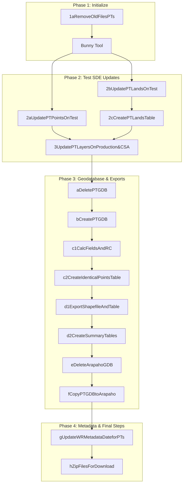

<h1 align="center"> Provisional Temporary Permits Workflow</h1>

## Overview
This script consolidates and replaces the functionality of 16 existing ArcGIS ModelBuilder workflows from the [toolboxes](G:/GIS/ArcGIS/Toolboxes) Z_SDE_Layers_Update108 and Z_PT_Water_Rights_102. These models automate updates to Provisional Temporary (PT) permits within the Test and Production Enterprise Geodatabases (SDE) on both **OWRBGIS** and **CSA** environments. 

This script is intended as a unified, maintainable alternative to the model-based approach. This document outlines dependencies for each model, identifies deprecated tools and their replacements, and provides detailed model breakdowns, including descriptions, inputs, outputs, and the Python code used. 

This documentation complements the Word documente titled, **'Updating the Provisional Temporary Permits GIS Layers'**, stored at: G:\GIS\ArcGIS\Toolboxes\ArcGIS_Pro_Toolboxes\Z_SDE_Layers_Update_Pro\Water Rights\PTs. Licensing requirements vary by step. Most of the initial models can be executed with any ArcGIS license level. However, editing steps require ArcEditor (Professional) or ArcInfo (Professional Plus) licenses, as outlined in the referenced Word document. 

The following database and folder connections are required:
- **SDE Connections**:
  - OWRBGIS@esri_owrp.sde (`prodSDE`)
  - OWRBGIS@esri_owrt.sde (`testSDE`)
  - owrp_csa.sde (`csaProdSDE`) 
   
- **Oracle Connection**:
  - OWRP.odc (`oracleODC`)

- **Folder Paths**:
  - \\\Arapaho\MasterCovs\
  - \\\OWRBGIS\GeoDat\
  - \\\172.30.73.39\webfinal\

The current process uses the ArcMap project [PT_Update106.mxd](G:\Programs\Water_Rights\z_GIS_App\PTs) and the ArcGIS Pro project [PTs_Updates_Pro.aprx](G:\Programs\Water_Rights\z_GIS_App\PTs\PTs_Updates_Pro), which contain the layers: 
- OWRBGIS.WR_PT_Points
- OWRBGIS.WR_PT_Lands

---

## Workflow Summary
The script replicates and enhances the following steps:

- **1aRemoveOldFilesPTs**: Removes outdated features from relevant tables and feature classes. 
- **The Water Rights Legal Automatic Map Tool** **(Bunny Tool)**: Generates updated point and land features in the ArcGIS project. 
- **2aUpdatePTPointsOnTest**: Updates attribute data for point features. 
- **2bUpdatePTLandsOnTest**: Updates attribute data for land featuers.
- **2cCreatePTLandsTable**:  Creates a related table of PT Lands (*temporary workaround* for half divisions inaccuracies).
- **3UpdatePTLayersOnProduction&CSA**: Updates the production SDEs on OWRBGIS and CSA.

The next section focuses on the PT geodatabase and requires a Professional or Professional Plus license. These 11 models reside in the Z_PT_Water_Rights_102.tbx [toolbox](G:\GIS\ArcGIS\Toolboxes):

- **aDeletePTGDB**: Deletes PTs.gdb in [temp](G:\Temp) folder. 
- **bCreatePTGDB**: Recreates PTs.gdb in [temp](G:\Temp) folder. 
- **c1CalcFieldsAndRC**: Calculate required fields and creates relationship classes. 
- **c2CreateIdenticalPointsTable - Modify Start Date**: **Note**: Manually edit the "Make Feature Layer" tool to set the DATE_ISSUED filter to two years prior to the current date: 
  ```SQL
  # Expression
  DATE_ISSUED >= date'2023-03-31 00:00:00'
  ```
  This table supports Water Rights staff in identifying multiple PTs for the same location.
- **d1 Export Shapefile And Table**: Exports PT points (shapefile) and lands (table) for public download.
- **d2CreateSummaryTables**: Generates annual summary tables saved as [z_sum_Tables](A:\z_GDBs\z_sum_Tables).
  
**Note**: This portion must be run after hours to avoid database locks, and only ran once at the beginning of the month.

- **eDeleteArapahoGDB**: Deletes the [WaterRights_PTs.gdb](A:\z_GDBs).
- **fCopyPTGDBtoArapaho**: Copies PTs.gdb to [WaterRights_PTs.gdb](A:\z_GDBs).
- **gUpdateWRMetadataDateforPTs**: Updates metadata for web and ArcGIS Online.
- **hZip Files for Download**: Zips data files for public access.
- **iExportSHPMetadata**: Exports metadata to .htm format for website and ArcGIS Online integration.


---


## Dependencies
| Step                                                    | Depends On
|---------------------------------------------------------|-------------------------------------------------------------------------
|**1aRemoveOldFilesPTs**                                  | None
|**Bunny Tool**                                           | 1aRemoveOLdFilesPTs
|**2aUpdatePTPointsOnTest**                               | 1aRemoveOldFilesPTs, Bunny Tool
|**2bUpdatePTLandsOnTest**                                | 1aRemoveOldFilesPTs, Bunny Tool
|**2cCreatePTLandsTable**                                 | 2bUpdatePTLandsOnTest
|**3UpdatePTLayersOnProduction&CSA**                      | 2aUpdatePTPointsOnTest, 2bUpdatePTLandsOnTest, 2cCreatePTLandsTable
|**aDeletePTGDB**                                         | 3UpdatePTLayersONProduction&CSA
|**bCreatePTGDB**                                         | aDeletePTGDB
|**c1CalcFieldsAndRC**                                    | bCreatePTGDB
|**c2CreateIdenticalPointsTable - Modify Start Date**     | c1CalcFieldsAndRC
|**d1 Export Shapefile And Table**                        | c2CreateIdenticalPointsTable
|**d2CreateSummaryTables**                                | d1 Export Shapefile And Table
|**eDeleteArapahoGDB**                                    | d2CreateSummaryTables
|**fCopyPTGDBtoArapaho**                                  | eDeleteArapahoGDB
|**gUpdateWRMetadataDateforPTs**                          | None
|**hZip Files for Download**                              | gUpdateWRMetadataDateforPTs, fCopyPTGDBtoArapaho
|**iExportSHPMetadata**                                   | hZip Files for Download
---

## Workflow Diagram



## Tools Used
- Delete Features (Data Management)
  - Deletes all or the selected subset of features from the input. Keeps the schema.
  - Used with Basic, Standard, and Advanced licenses.
  - **arcpy.management.DeleteFeatures(in_features)**
    - in_features: The feature class, shapefile, or layer containing features to be deleted.
  
- Delete (Data Management) 
  - Permanently deletes data.
  - Creator, Professional, or Professional Plus can be used.
  - **arcpy.management.Delete(in_data, {data_type})**
    - in_data [in_data,...]: The input data that will be deleted.
    - data_type (Optional): The type of data on disk to be deleted. Only necessary in the event of a name conflict.
      - **FeatureClass**
      - **FeatureDataset**
      - **MosaicDataset**
      - **ParcelFabric**
      - **RelationshipClass**
      - **Topology**

- Feature Class to Feature Class (Conversion) - **Deprecated Tool** - replaced by **Export Features**
  - Converts a feature class or feature layer to a feature class.

- Export Features (Conversion)
  - Converts a feature class or feature layer to a new feature class.
  - Creator, Professional, or Professional Plus can be used.
  - **arcpy.conversion.ExportFeatures(in_features, out_features, {where_clause}, {use_field_alias_as_name}, {field_mapping}, {sort_field})**
    - in_features: The input features that will be exported to a new feature class.
    - out_features: The output feature class containing the exported features.
    - where_clause (Optional): An expression written in SQL is used to select a subset of features.
    - use_field_alias_as_name (Optional): Specifies whether the input's field names or field aliases will be used as the output field name.
      - **NOT_USE_ALIAS** - The input's field names will be used as the output field names. **This is the default.**
      - **USE_ALIAS** - The input's field aliases will be used as the output field names.
    - field_mapping (Optional) - The fields that will be transferred to the output dataset with their respective properties and source fields. **The output includes all fields from the input dataset by default.**
      - Use the field map to add, delete, rename, and reorder fields, as well as change other field properties.
      - The field map can also be used to combine values from two or more input fields into a single output field.
    - sort_field [sort_field,...] (Optional): The field or fields whose values will be used to reorder the input records and the direction the records will be sorted.
      - **ASCENDING** - Records will be sorted from low value to high value.
      - **DESCENDING** - Records will be sorted from high value to low value.
  
- Table to Table (Conversion) - **Deprecated Tool** - replaced by **Export Table**
  - Exports the rows of a table to a different table.

- Export Table (Conversion)
  - Exports the rows of a table or table view to a new table.
  - Creator, Professional, or Professional Plus can be used.
  - **arcpy.conversion.ExportTable(in_table, out_table, {where_clause}, use_field_alias_as_name, {field_mapping}, {sort_field})**
    - in_table: The input table containing the rows to be exported to a new table.
    - out_table: The output table containing the exported rows.
    - where_clause (Optional): An expression written in SQL is used to select a subset of features.
    - use_field_alias_as_name: Specifies whether the input's field names or field aliases will be used as the output field name.
      - **NOT_USE_ALIAS** - The input's field names will be used as the output field names. **This is the default.**
      - **USE_ALIAS** - The input's field aliases will be used as the output field names.
    - field_mapping (Optional):The fields that will be transferred to the output dataset with their respective properties and source fields. **The output includes all fields from the input dataset by default.**
    - sort_field [sort_field,...] (Optional): The field or fields whose values will be used to reorder the input records and the direction the records will be sorted.
      - **ASCENDING** - Records will be sorted from low value to high value.
      - **DESCENDING** - Records will be sorted from high value to low value.

- Make Table View (Data Management)
  - Creates a table view from an input table or feature class. The table view that is created is temporary and will not persist after the session ends unless the document is saved.
  - Creator, Professional, or Professional Plus can be used.
  - **arcpy.management.MakeTableView(in_table, out_view, {where_clause}, {workspace}, {field_info})**
    - in_table: The input table or feature class.
    - out_view: The name of the table view to be created.
    - where_clause (Optional): An expression written in SQL is used to select a subset of features.
    - ~~workspace (Optional)~~: This parameter is not used.
    - field_info (Optional): The fields from the input table that will be included in the output layer. 

- Join Field (Data Management)
  - Permanently joins the contents of a table to another table based on a common attribute field. The input table is updated to contain the fields from the join table. You can select which fields from the join table will be added to the input table.
  - Creator, Professional, or Professional Plus can be used.
  - **arcpy.management.JoinField(in_data, in_field, join_table, join_field, {fields}, {fm_option}, {field_mapping}, {index_join_fields})**
    - in_data: The table or feature class to which the join table will be joined.
    - in_field: The field in the input table on which the join will be based.
    - join_table: The table that will be joined to the input table.
    - join_field: The field in the join table that contains the values on which the join will be based.
    - fields [fields,...] (Optional): The fields from the join table that will be transferred to the input table based on a join between the input table and the join table.
    - fm_option (Optional): Specifies how joining fields and field types will be transferred to the output.
      - **NOT_USE_FM** - Fields and field types from the joined tables will be transferred to the output. **This is the default.**
      - **USE_FM** - The transfer of fields and field types from the joined table to the output will be controlled by the **field_mapping** parameter.
    - field_mapping (Optional): The fields that will be joined to the input table with their respective properties and source fields. **All fields from the join table will be included by default.**
    - index_join_fields (Optional): Specifies whether attribute indexes will be added or replaced for the input field and join field.
      - **NO_INDEXES** - Attribute indexes will not be added. **This is the default.**
      - **NEW_INDEXES** - An attribute index will be added for any field that does not have an index. Existing attribute indexes will be retained.
      - **REPLACE_INDEXES** - An attribute index will be added for any field that does nto have an index. Existing attribute indexes will be replaced.

- Make Feature Layer (Data Management)
  - Creates a feature layer from a feature class or layer file. The layer that is created is temporary and will not persist after the session ends unless the layer is saved to disk or the map document is saved.
  - Creator, Professional, or Professional Plus can be used.
  - **arcpy.management.MakeFeatureLayer(in_features, out_layer, {where_clause}, {workspace}, {field_info})**
    - in_features: The input feature class or layer from which they new layer will be made.
    - out_layer: The name of the feature layer to be created. 
    - where_clause (Optional): An expression written in SQL is used to select a subset of features.
    - ~~workspace (Optional)~~: This parameter is not used.
    - field_info (Optional): The fields from the input features that will be included in the output layer.

- Add Join (Data Management)
  - Joins a layer to another layer or table based on a common field. Feature layers, table views, and raster layers with a raster attribute table are supported.
  - Creator, Professional, or Professional Plus can be used.
  - **arcpy.management.AddJoin(in_layer_or_view, in_field, join_table, join_field, {join_type}, {index_join_fields}, {rebuild_index}, {join_operation})**
    - in_layer_or_view: The layer or table view to which the join table will be joined.
    - in_field: The field in the input layer or table view on which the join will be based.
    - join_table: The table or table view that will be joined to the input layer or table view.
    - join_field: The field in the join table that contains the values on which the join will be based.
    - join_type (Optional): Specifies whether only records in the input that match a record in the join table will be included in the output or all records in the input layer or table view will be included.
      - **KEEP_ALL** - All recod in the input layer or table view will be included in the output. This is also known as an outer join. **This is the default.**
      - **KEEP_COMMON** - Only those records in the input that match a row in the join table will be included in the output. This is also known as the inner join.
    - index_join_fields (Optional): Specifies whether table attribute indexes will be added to the input field and join field.
      - **INDEX_JOIN_FIELDS** - Both fields will be indexed. If the table has an existing index, a new index will not be added.
      - **NO_INDEX_JOIN_FIELDS** - Indexes will not be added. **This is the default.**
    - rebuild_index (Optional): Specifies whether the indexes of the input field and join field will be removed and rebuilt.
      - **REBUILD_INDEX** - Existing indexes will be removed and a new index will be added.
      - **NO_REBUILD_INDEX** - Exisiting indexes will not be removed or rebuilt. **This is the default.**
    - join_operation (Optional): Specifies whether the join will be a one-to-many join or one-to-first join when the data has a one-to-many cardinality.
      - **JOIN_ONE_TO_FIRST** - The join operation will use the first match.
      - **JOIN_ONE_TO_MANY** - The  join opertion will perform multiple case-sensitive matches.

- Calculate Field (Data Management)
  - Calculates the values of a field for a feature class, feature layer, or raster.
  - Creator, Professional, or Professional Plus can be used.
  - **arcpy.management.CalculateField(in_table, field, expression, {expression_type}, {code_block}, {field_type}, {enforce_domains})**
    - in_table: The table containing the field that will be updated with the new calculation.
    - field: The field that will be updated with the new calculation.
    - expression: The simple calculation expression used to create a value that will populate the selected rows.
    - expression_type (Optional): Specifies the type of expression that will be used.
      - **PYTHON3** - Python expression type will be used.
      - **ARCADE** - Arcade expression type will be used.
      - **SQL** - SQL expression type will be used.
      - **VB** - VBScript expression type will be used.
    - code_block (Optional): A block of code that will be used for complex `Python` or `VBScript` expressions.
    - field_type (Optional): Specifies the field type of the new field. This parameter is only used when the field name does not exist in the input table.
      - **SHORT** - Short fields support whole numbers between -32,768 and 32,767.
      - **LONG** - Long fields support whole numbers between -2,147,483,648 and 2,147,483,647.
      - **BIGINTEGER** - Big intefer fields support whole numbers between -(2<sup>53</sup>) and 2<sup>53<sup>.
      - **FLOAT** - Float fields support fractional numbers between -3.4E38 and 1.2E38.
      - **DOUBLE** - Double fields support fractional numbers between -2.2E308 and 1.8E308. 
      - **TEXT** - Text fields support a string of characters.
      - **DATE** - Date fields support date and time values.
      - **DATEHIGHPRECISION** - High precision date fields support date and time values with millisecond time.
      - **DATEONLY** - Date only fields support date values with no time values.
      - **TIMEONLY** - Time only fields support time values with no date values.
      - **TIMESTAMPOFFSET** - Timestamp offset fields support a date, time, and offset from a UTC value.
      - **BLOB** - BLOB fields support data stored as a long sequence of binary numbers.
      - **GUID** - GUID fields store registry-style strings consisting of 36 characters enclosed in curly brackets.
      - **RASTER** - Raster fields can store raster data in or alongside the geodatabase.
    - enforce_domains (Optional): Specifies whether field domain ruls will be enforced.
      - **ENFORCE_DOMAINS** - Field domain rules will be enforced.
      - **NO_ENFORCE_DOMAINS** - Field domain rules will not be enforced. **This is the default.**

- Remove Join (Data Management)
  - Removes a join from a feature layer or table view.
  - Creator, Professional, or Professional Plus can be used.
  - **arcpy.management.RemoveJoin(in_layer_or_view, {join_name})**
    - in_layer_or_view: The layer or table view from which the join will be removed.
    - join_name (Optional): The name of the join to be removed.

- Append (Data Management)
  - Appends to, or optionally updates, and existing target dataset with multiple input datasets. Input datasets can be feature classes, tables, shapefiles, rasters, or annotation or dimension feature classes.
  - Creator, Professional, or Professional Plus can be used.
  - **arcpy.management.Append(inputs, target, {schema_type}, {field_mapping}, {subtype}, {expression}, {match_fields}, {update_geometry}, {enforce_domains})**
    - inputs [inputs,...]: The input dataset containing the data to be appended to the target dataset.
    - target: The existing dataset where the data of the input datasets will be appended.
    - schema_type (Optional): Specifies whether the fields of the input datasets must match the fields of the target dataset for data to be appended.
      - **TEST** - Fields of the input datasets must match the fields of the target dataset.
      - **NO_TEST** - Fields of the input datasets do not need to match the fields of the target dataset.
      - **TEST_AND_SKIP** - Fields of the input dataset must match the fields of the target dataset. If any of the input datasets contain fields that do not match the target dataset, that input dataset will be omitted with a warning message.
    - field_mapping (Optional): The field map parameter controls the transfer or maping of fields from the input datasets to the target dataset. It can only be used when the **schema_type** parameter is set to **NO_TEST.**
    - subtype (Optional): The subtype description that will be assigned to all new data that is appended to the target dataset.
    - expression (Optional): The SQL expression that will be used to select a subset of the input datasets' records.
    - match_fields [[target_field, input_field],...] (Optional): The fields from the input datasets that will be used to match to the target dataset.
    - update_geometry (Optional): Specifies whether geometry in the target dataset will be updated with geometry from the input datasets if the **match_fields** parameter field values match.
      - **UPDATE_GEOMETRY** - Geometry in the target dataset will be updated if the **match_fields** parameter field values match.
      - **NOT_UPDATE_GEOMETRY** - Geometry will not be updated. **This is the default.**
    - enforce_domains (Optional): Specifies whether field domain rules will be enforced.
      - **ENFORCE_DOMAINS** - Field domain rules will be enforced.
      - **NO_ENFORCE_DOMAINS** - Field domain rules will not be enforced. **This is the default.**

- Metadata Importer **This is no longer a tool in Pro; it is a <ins>module</ins> in the arcpy `Python` library**
  - **arcpy.MetadataImporter** class
  - New steps for importing metadata:
    - Ensure XML file is compliant with the ArcGIS metadata standard.
      - ArcGIS Pro uses the ISO 19139 metadata standard, so your XML should align with this format.
    - Use the `arcpy.MetadataImporter` class to import metadata from the XML file into your feature class or other GIS item.
    ```Python
    # Path to the XML metadata file
    xml_metadata_file = r"\\Arapaho\MasterCovs\z_Metadata\Water_Rights\Updates\WR_PT_Lands_All.xml"

    # Path to the target feature class in your SDE
    targetFC = owrp_csa.sde\owrp.sde.WR_PT_Lands_All
    
    # Create a MetadataImporter object
    metadata_importer = arcpy.MetadataImporter(xml_metadata_file)

    # Import the metadata into the target FC
    metadata_importer.importMetadata(targetFC)
    ```
    
- Truncate Table (Data Management)
  - Removes all rows from a database table or feature class using truncate procedures in the database.
  - Creator, Professional, or Professional Plus can be used.
  - **arcpy.management.TruncateTable(in_table)**
    - in_table: The input database table or feature class that will be truncated.

- Iterate Tables (ModelBuilder)
  - This tool is intended for use in ArcGIS ModelBuilder and not in Python scripting. 
  - Tables in a folder can be restricted to iterate on table types such as dBASE and INFO. 
    - The first import table is used as a template for the output. This allows for selection of fields in subsquent tools. The tool has two outputs:
      - Table
      - Name
      - Could be used as in-line variables (e.g. %Name%) in other tools.
  - If an Iterator is added to a model, all tools in the model iterate for each value in the iterator. If you do not want to run each tool in the model for each iterated value, create a sub-model/model within a model/nested model that contains on the iterator and add it as a model tool into the main model.

- Create File Geodatabase (Data Management)
  - Creates a file geodatabase in a folder.
  - **arcpy.management.CreateFileGDB(out_folder_path, out_name, {out_version})**
    - out_folder_path: The folder where the file geodatabase will be created.
    - out_name: The name of the file geodatabase to be created.
    - out_version: Specifies the ArcGIS version for the new geodatabase.
      - **CURRENT** - A geodatabase compatible with the currently installed version of ArcGIS will be created. *This is the default*.
      - **10.0** - A geodatabase compatible with ArcGIS 10 will be created.
      - **9.3** - A geodatabase compatible with ArcGIS 9.3 will be created.
      - **9.2** - A geodatabase compatible with ArcGIS 9.2 will be created.

- Create Relationship Class (Data Management)
  - Creates a relationship class to store an association between fields or features in the origin table and the destination table.
  - **arcpy.management.CreateRelationshipClass(origin_table, destination_table, out_relationship_class, relationship_type, forward_label, backward_label, message_direction, cardinality, attributed, origin_primary_key, origin_foreign_key, {destination_primary_key}, {destination_foreign_key})**
    - origin_table: The table or feature class that is associated with the destination table.
    - destination_table: The table that is associated with the origin table
    - out_relationship_class: The relationship class that will be created
    - relationship_type: Specifies the type of relationship that will be created between the origin and destination tables.
      - **SIMPLE** - The origin and destination tables will have a simple relationship. *This is the default*.
      - **COMPOSITE** - The origin and destination table will have a composite relationship.
    - forward_label: A name to uniquely identify the relationship when navigating from the origin table to the destination table.
    - backward_label: A name to uniquely identify the relationship when navigating from the destination table to the origin table.
    - message_direction: Specifies the direction in which messages will be passed between the origin and destination tables.
      - **FORWARD** - Messages will be passed from the origin table to the destination table.
      - **BACKWARD** - Messages will be passed from the destination table to the origin table.
      - **BOTH** - Messages will be passed from the origin table to the destination table and from the destination table to the origin table.
      - **NONE** - No messages will be passed. *This is the default*.
    - cardinality: Specifies how many relationship will exist between rows or features in the origin table and rows or features in the destination table.
      - **ONE_TO_ONE** - Each row or feature in the origin table can be related to zero or one row or feature in the destination table. *This is the default*.
      - **ONE_TO_MANY** - Each row or feature in the origin table can be related to one or several rows or features in the destination table.
      - **MANY_TO_MANY** - Several rows or features in the origin table can be related to one or several rows or features in the destination table.
    - attributed: Specifies whether the relationship class will have attiributes.
      - **NONE** - The relationship class will not have attributes. *This is the default*. 
      - **ATTRIBUTED** - The relationship class will have attributes.
    - origin_primary_key: For many-to-many or attributed relationship classes, this is the field in the origin table that links to the **origin_foreign_key** field in the relationship class table. For one-to-one or one-to-many relationship classes that are not attributed, this is the field in the origin table that links to the **origin_foreign_key** field in the detination table.
    - origin_foreign_key: For many-to-many or relationship classes, this is the field in the relationship class table that links to the **origin_primary_key** field in the origin table. For one-to-one or one-to-many relationship classes that are not attributed, this is the field in the destination table that links to the **origin_primary_key** field in the origin table.
    - destination_priamry_key (optional): The field in the destination table that links to the **destination_foreign_key** field in the relationship class table. This value is required for many-to-many or attributed relationship classes, but should be left empty for one-to-one or one-to-many relationship classes that are not attributed.
    - destination_foreign_key (optional): The field in the relationship class table that links to the **destination_primary_key** field in the destination table. This value is required for many-to-many or attributed relationship classes, but should be left empty for one-to-one or one-to-many relationship classes that are not attributed.

- Add Field (Data Managmenet)
  - Adds a new field to a table or the table ofa  feature class or feature layer, as well as to rasters with attribute tables.
  - **arcpy.management.AddField(in_table, field_name, field_type, {field_prescision}, {field_scale}, {field_length}, {field_alias}, {field_is_nullable}, {field_is_required}, {field_domain})**
    - in_table: The input table where the specified field will be added. The field will be added to the existing input table and will not create a new output table.
    - field_name: The name of the field tht will be added to the input table.
    - field_type: Specifies the field type of the new field.
      - **SHORT** - Short fields support whole numbers between -32,768 and 32,767.
      - **LONG** - Long fields support whole numbers between -2,147,483,648 and 2,147,483,647.
      - **BIGINTEGER** - Big integer fields supports whole numbers between -(2<sup>53</sup>) and 2<sup>53</sup>.
      - **FLOAT** - Float fields support fractional numbers between -3.4E38 and 1.2E38.
      - **DOUBLE** - Double fields support fractional numbers between -2.2E308 and 1.8E308.
      - **TEXT** - Text fields support a string of characters.
      - **DATE** - Date fields support date and time values.
      - **DATEHIGHPRECISION** - High precision date fields support date and time values with millisecon time.
      - **DATEONLY** - Date only fields support date values with no time values.
      - **TIMEONLY** - Time only fields support time values with no date values.
      - **TIMESTAMPOFFSET** - Timestamp offset fields support a date, time, and offset from a UTC value.
      - **BLOB** - BLOB fields support data stored as long sequence of binary numbers. You need a custom loader or viewer or a third-party application to load items into a BLOB field or view the contents of a BLOB field.
      - **GUID** - GUID fields store registry-style strings consisting of 36 characters enclosed in curly brackets.
      - **RASTER** - Raster fields can store raster data in or alongside the geodatabase. All ArcGIS software-supported raster dataset formats can be stored, but it is recommended that only small images be used.
    - field_precision (Optional): The number of digits that can be stored in the field. All digits are counted regardless of which side of the decimal they are on.
    - field_scale (Optional): The number of decimal places stored in a field.
    - field_length (Optional): The length of the field. This sets the maximum number of allowable characters for each reord of the field. If no length is provided, a length of 255 will be used.
    - field_alias (Optional): The alternate name for the field.
    - field_is_nullable (Optional): Specifies whether the field can contain null values.
      - **NULLABLE** - The field can contain null values. *This is the default.*
      - **NON_NULLABLE** - The field cannot contain null values.
    - field_is_required (Optional): Specifies whether the field being created is a required field for the table.
      - **NON_REQUIRED** - The field is not a required field. *This is the default.*
      - **REQUIRED** - The field is a required field. Required fields are permanent and cannot be deleted.
    - field_domain (Optional): Constrains the values allowed in any particular attribute for a table, feature class, or subtype in a geodatabase. You must specify the name of an existing domain for ir to be applied to the field.

- Find Identical (Data Management)
  - Reports any records in a feature class or table that have identical values in a list of a fields, and generates a table listing the identical records. If the Shape field is specified, feature geometries will be compared. 
  - **arcpy.management.FindIdentical(in_dataset, out_dataset, fields, {xy_tolerance}, {z_tolerance}, {output_record_option})**
    - in_dataset: The table or feature class for which identical records will be found.
    - out_dataset: The ouput table reporting identical records. The FEAT_SEQ feild in the output table will have the same values for identical records.
    - fields [fields,...]: The field or fields whose values will be compared to find identical records.
    - xy_tolerance (Optional): The x, y tolerance that will be applied to each vertex when evaluating whether there is an identical vertex in another feature.
    - z_tolerance (Optional): The z-tolerance that will be applied to each vertex when evaluating whether theer is an identical vertex in another feature.
    - output_record_option (Optional): Specifies whether only duplicated records will be included in the output table.
      - **ALL** - All input records will have corresponding records in the output table. *This is the default.*
      - **ONLY_DUPLICATES** - Only duplicate records will have corresponding records in the output table. The output will be empty if no duplicate is found.

- Summary Statistics (Analysis)
  - Calculates summary statistics for fields in a table.
  - **arcpy.analysis.Statistics(in_table, out_table, statistics_fields, {case_field}, {concatenation_separator})**
    - in_table: The input table containing the fields that will be used to calculate statistics.
    - out_table: The output table that will store the calculated statistics.
    - statistics_fields [[field, {statistic_type}],...]: Specifies the field or fields containing the attribute values that will be used to calculate the specified statistic.
      - **SUM** - The values for the specified field will be added together.
      - **MEAN** - The average for the specified field will be calculated.
      - **MIN** - The smallest value of the specified field will be identified.
      - **MAX** - The largest value of the specified field will be identified.
      - **RANGE** - The range of values (MAX - MIN) for the specified field will be calculated.
      - **STD** - The standard deviation of values for the specified field will be calculated.
      - **COUNT** - The number of values in the specified field will be identified.
      - **FIRST** - The specified field value of the first record in the input will be used.
      - **LAST** - The specified field value of the last record in the input will be used.
      - **MEDIAN** - The median of the speccified field will be calculated.
      - **VARIANCE** - The variance fo the specified field will be calculated.
      - **UNIQUE** - The number of unique values of the specified field will be counted.
      - **CONCATENATE** - The values for the specified field will be concatenated. The values can be separated using the **concatenation_separator** parameter.
      - **MODE** - The mode (the most common value) for the specified field will be identified. If more than one value is equally common, the lowest value will be returned.
      - **DBMS_SUM** - The values for the specified field will be added together.
      - **DBMS_MEAN** - The average for the specified field will be calculated.
      - **DBMS_MIN** - The smallest value of the specified field will be identified.
      - **DBMS_MAX** - The laregest value of the specified field will be identified.
      - **DBMS_STD** - The standard deviation of values for the specified field will be calculated.
      - **DBMS_COUNT** - The number of values in the specified field will be identified.
      - **DBMS_MEDIAN** - The median of the specified field will be calculated.
      - **DBMS_VARIANCE** - The variance of the specified field will be calculated.
    - case_field [case_field,...] (Optional): The field or fields in the input that will be used to calculated statistics separately for each unique attribute value (or combination of attribute values when multiple fields are specified). 
    - concatenation_separator (Optional): A character or characters that will be used to concatenate values when the **CONCATENATION** option is used for the **statistics_fields** parameter. By default, the tool will concatenate values without a separator.

- Table To dBASE (Conversion)
  - Converts one or more tables to dBASE tables.
  - **arcpy.conversion.TableToDBASE(input_table, output_folder)**
    - input_table [table,...]: The list of tables to be converted to dBASE tables.
    - output_folder: The destination folder where the output dBASE tables will be placed.

- Copy (Data Management)
  - Copies the input data to an output workspace of the same data type as the input workspace.
  - **arcpy.management.Copy(in_data, out_data, {data_type}, {associated_data})**
    - in_data: The data that will be copied.
    - out_data: The location and name of the output data. The file name extension of the output data must match the extension of the input data. For example, if you are copying a file goedatabase, the output data element must have .gdb as a suffix.
    - data_type (Optional): The type of the data on disk that will be copied.
      - **FeatureClass** - In the event of duplicate names, the feature class will be used.
      - **FeatureDataset** - In the event of duplicate names, the feature dataset will be used.
      - **MosaicDataset** - In the event of duplicate names, the mosaid dataset will be used.
      - **ParcelFabric** - In the event of duplicate names, the parcel fabric will be used.
      - **RelationshipClass** - In the event of duplicate names, the relationship class will be used.
      - **Topology** - In the event of duplicate names, the topology will be used.
    - associated_data [[from_name, data_type, to_name, config_keyword], ...] (Optional): When the input has associated data, this parameter can be used to control the associated output data's name and config keyword.
      - **from_name** - The data associated with the input data, which will also be copied.
      - **data_type** - The type of the data on disk that will be copied.
      - **to_name** - The name of the copied data in the **out_data** parameter value.
      - **config_keyword** - The geodatabase storage parameters (configuration).

- USGS MP Metadata Translator (Conversion) **This is no longer a tool in Pro; it is a <ins>module</ins> in the arcpy `Python` library**
  - Uses the USGS metadata parser utility, known as mp, to export or validate FGDC metadata content. The mp utility is created and maintained by the USGS for managing metadata that follows the FGDC Content Standard for Digital Geospatial Metadata (CSDGM). A version of mp is provided with ArcGIS.
  - Need to download the most recent version of the USGS's metadata parser utility, mp, from the [USGS website](https://geology.usgs.gov/tools/metadata/tools/doc/mp.html), and run it in your Python script using `os.system` as illustrated below:
```Python
import os

csdgm_xml_file = "D:/Metadata_Pro/arcpy/Map_current_csdgm.xml"
csdgm_txt_file = "D:/Metadata_Pro/arcpy/Output/csdgm_to_text.txt"
runCmd = r"C:\Tools\mp-2.9.50\tools\bin\mp.exe " + csdgm_txt_file + " -x " + csdgm_xml_file
print(runCmd)
os.system(runCmd)
```

- Import Metadata (Conversion) **This is no longer a tool in Pro**
  - Imports metadata to the target item after converting the source item's metadata to ArcGIS metadata, if appropriate. The source and target may be ArcGIS items or stand-alone metadata XML files.
  - More information is found at this [website](https://pro.arcgis.com/en/pro-app/latest/help/metadata/copy-or-import-metadata-to-an-item.htm).
  - See Import Metadata above.


## Model 1aRemoveOldFilesPTs

### Description
Removes the old provisional temporary (90-day)(PT) data from Feature Classes (FC) and Database Tables on the Test SDE (OWRT). **Model will not need to be included as it is already apart of the new Auto Mapper tool that was developed by the Center for Spatial Analysis at the University of Oklahoma**

### Inputs
- Feature Classes
- Database Tables

### Outputs
- Feature Classes (schema only)
- Database Tables (schema only)

### Dependencies
- None

### Tools Used
- Delete Features (Data Management)
- Delete (Data Management)

### Parameters
- None

### Licenses Needed
- Creator, Professional, or Professional Plus can be used.

### Detailed Workflow
1. **Step 1**: Deletes all features from OWRBGIS@esri_owrt.sde\OWRBGIS.WR_PT_Points. Schema is kept.
   ```Python
   arcpy.management.DeleteFeatures(OWRBGIS@esri_owrt.sde\OWRBGIS.WR_PT_Points)
   ```
2. **Step 2**: Deletes all features from OWRBGIS@esri_owrt.sde\OWRBGIS.WR_PT_Lands. Schema is kept.
   ```Python
   arcpy.management.DeleteFeatures(OWRBGIS@esri_owrt.sde\OWRBGIS.WR_PT_Lands)
   ```
3. **Step 3**: Permanently deletes all data from OWRBGIS@esri_owrt.sde\OWRBGIS.WR_PT_Points_Active.
   ```Python
   arcpy.management.Delete(OWRBGIS@esri_owrt.sde\OWRBGIS.WR_PT_Points_Active)
   ```
4. **Step 4**: Permanently deletes all data from OWRBGIS@esri_owrt.sde\OWRBGIS.WR_PT_Points_All.
   ```Python
   arcpy.management.Delete(OWRBGIS@esri_owrt.sde\OWRBGIS.WR_PT_Points_All)
   ```
5. **Step 5**: Permanently deletes all data from OWRBGIS@esri_owrt.sde\OWRBGIS.D_WR_STLEGAL.
    ```Python
    arcpy.management.Delete(OWRBGIS@esri_owrt.sde\OWRBGIS.D_WR_STLEGAL)
    ```
6. **Step 6**: Permanently deletes all data from OWRBGIS@esri_owrt.sde\OWRBGIS.D_WR_STPERMIT.
    ```Python
    arcpy.management.Delete(OWRBGIS@esri_owrt.sde\OWRBGIS.D_WR_STPERMIT)
    ```
7. **Step 7**: Permanently deletes all data from OWRBGIS@esri_owrt.sde\OWRBGIS.WR_PT_Lands_Active.
   ```Python
   arcpy.management.Delete(OWRBGIS@esri_owrt.sde\OWRBGIS.WR_PT_Lands_Active)
   ```
8. **Step 8**: Permanently deletes all data from OWRBGIS@esri_owrt.sde\OWRBGIS.WR_PT_Lands_All.
   ```Python
   arcpy.management.Delete(OWRBGIS@esri_owrt.sde\OWRBGIS.WR_PT_Lands_All)
   ```
9. **Step 9**: Permanently deletes all data from OWRBGIS@esri_owrt.sde\OWRBGIS.WR_PT_Lands_TMP_Legal.
    ```Python
    arcpy.management.Delete(OWRBGIS@esri_owrt.sde\OWRBGIS.WR_PT_Lands_TMP_Legal)
    ```
10. **Step 10**: Permanently deletes all data from OWRBGIS@esri_owrt.sde\OWRBGIS.WR_PT_Points_TMP_Legal.
    ```Python
    arcpy.management.Delete(OWRBGIS@esri_owrt.sde\OWRBGIS.WR_PT_Points_TMP_Legal)
    ```
---

## Modules to import
These are modules need to run the different functions throughout the script.

- JSON - Allows the ability to load the JSON file and access its contents
- arcpy - Allows access to arcpy libraries.
- concurrent.futures - Allows steps to be ran at the same time
- pathlib - Modern path manipulation (replaces os.path)
- shutil - For file operations (e.g., copying metadata)
- logging - For advanced log configuration
- datetime - For dynamic date filters
- xml.etree.ElementTree - For parsing/editing XML metadata
- traceback - For detailed error logging
- pydantic - Validate config schema (install with 'pip install pydantic')
- functools - For timing decorators
- zipfile - If manually handling zips (alternative to 7-Zip CLI)
- asyncio - If using async I/O for metadata ops
- pyodbc - If using direct SQL queries, for Oracle connections
- os - For running CLI commands

```Python
# Import Standard Library
import json, logging, sys, time, shutil, traceback, pyodbc, os
from concurrent.futures import ThreadPoolExecutor
from datetime import datetime
from functools import wraps
from pathlib import Path
from logging.config import dictConfig
import xml.etree.ElementTree as ET

# Import Third-Party Library
import zipfile, asyncio
from pydantic import BaseModel

# Import ArcGIS Library
import arcpy
from arcpy import metadata as md

# Custom Library
sys.path.append(str(Path(__file__).parent / "modules"))
```
---

## Configuration File
The connections listed below will be listed in a `JSON` file where all inputs/outputs will be placed.


### Test SDE (OWRT)
- **Path**: 'C:\Users\342481.AGENCY\AppData\Roaming\Esri\ArcGISPro\Favorites\OWRBGIS@esri_owrt.sde'
- **Description**: Connection to the Test SDE (OWRT) database on OWRBGIS.


### Production SDE (OWRP)
- **Path**: 'C:\Users\342481.AGENCY\AppData\Roaming\Esri\ArcGISPro\Favorites\OWRBGIS@esri_owrp.sde'
- **Description**: Connection to the Production SDE (OWRP) database on OWRBGIS.


### Oracle ODC
- **Path**: 'C:\Users\342481.AGENCY\AppData\Roaming\Esri\ArcGISPro\Favorites\OWRP.odc'
- **Description**: Connection to the Oracle ODC databse.


### JSON File ('PT_Updates.JSON')
- **Path**: G:\GIS\ArcGIS\Toolboxes\ArcGIS_Pro_Toolboxes\Z_SDE_Layers_Update_Pro\Water Rights\PTs\PT_Updates.json
  ```JSON
  {
    "test_SDE": "C:\\Users\\342481.AGENCY\\AppData\\Roaming\\Esri\\ArcGISPro\\Favorites\\OWRBGIS@esri_owrt.sde", 
    "prod_SDE": "C:\\Users\\342481.AGENCY\\AppData\\Roaming\\Esri\\ArcGISPro\\Favorites\\OWRBGIS@esri_owrp.sde",
    "oracle_SDE": "C:\\Users\\342481.AGENCY\\AppData\\Roaming\\Esri\\ArcGISPro\\Favorites\\OWRP.odc",
    "csa_Prod_SDE": "C:\\Users\\342481.AGENCY\\AppData\\Roaming\\Esri\\ArcGISPro\\Favorites\\owrp_csa.sde"
  }
  ```
To access in the script will need to call the `JSON` file:
  ```Python
  # Path to JSON file
  jsonFile = r"G:\GIS\ArcGIS\Toolboxes\ArcGIS_Pro_Toolboxes\Z_SDE_Layers_Update_Pro\Water Rights\PTs\PT_Updates.json"

  # Load the JSON file
  with open(jsonFile, "r") as file:
      config = json.load(file)
  ```
  
---


## Model 2aUpdatePTPointsOnTest

### Description
Updates the PT Point features by pulling data from Test, Production, and Oracle for the Test SDE. The data is added to existing tables and feature classes that were previously cleared of old data. 

### Inputs
- Feature Classes
- Database Tables
- XML document

### Outputs
- Feature Classes
- Database Tables

### Dependencies
- 1aRemoveOldFilesPTs
- Water Rights Legal Automatic Map Tool

### Tools Used
- Export Features (Conversion)
- Export Table (Conversion)
- Make Table View (Data Management)
- Join Field (Data Management)
- Make Feature Layer (Data Management)
- Add Join (Data Management)
- Calculate Field (Data Management)
- Remove Join (Data Management)
- Append (Data Management)

### Parameters
- Join Fields
- SQL Expressions
- Python Expressions
- Schema Type

### Licenses Needed
- Creator, Professional, or Professional Plus can be used.

### Detailed Workflow

1. **Step 1**: Creates feature class from WR_PT_Points schema into WR_PT_Points_TMP_Legal. Exports rows from WR.WR_STPERMIT in Oracle database to D_WR_STPERMIT on OWRT. Exports rows from WR.WR_STLEGAL on OWRP to OWRT.
```Python
# Run Export Features tool
arcpy.conversion.ExportFeatures(f"{testSDE}\\OWRBGIS.WR_PT_Points", f"{testSDE}\\OWRBGIS.WR_PT_Points_TMP_Legal")

# Export rows in WR.WR_STPERMIT from Oracle to OWRBGIS.D_WR_STPERMIT on Test SDE
arcpy.conversion.ExportTable(f"{oracleODC}\\WR.WR_STPERMIT", f"{testSDE}\\OWRBGIS.D_WR_STPERMIT")

# Export rows in WR.WR_STLEGAL from Production SDE to OWRBGIS.D_WR_STLEGAL on Test SDE
arcpy.conversion.ExportTable(f"{prodSDE}\\WR.WR_STPERMIT", f"{testSDE}\\OWRBGIS.D_WR_STLEGAL")
```

  - To run all three at the same time first put each in their own function. Then use ThreadPoolExecutor in a `with` statement.
  ```Python
  # Run tasks concurrently
  with ThreadPoolExecutor(max_workers=3) as executor:
      futures = [
          executor.submit(run_ExportFeatures),
          executor.submit(run_ExportTableOracle),
          executor.submit(run_ExportTableProd)
      ]

      # Wait for all tasks to complete
      for future in futures:
          future.result()
  ```

2. **Step 2**: Creates a table view from OWRBGIS.D_WR_STPERMIT table on Test SDE. Joins OWRBGIS.D_WR_STLEGAL to OWRBGIS.WR_PT_Points_TMP_Legal.
   ```Python
   # Makes a table view from OWRBGIS.D_WR_STPERMIT on Test SDE.
   arcpy.management.MakeTableView(f"{testSDE}\\OWRBGIS.D_WR_STPERMIT", "D_WR_STPERMIT_View")

   # Joins OWRBGIS.D_WR_STLEGAL to OWRBGIS.WR_PT_Points TMP_Legal  tables on Test SDE using the RECORD_ID field as a join field from both tables.
   arcpy.management.JoinField(f"{testSDE}\\OWRBGIS.WR_PT_Points_TMP_Legal", "RECORD_ID", f"{testSDE}\\OWRBGIS.D_WR_STLEGAL", "RECORD_ID", ["WATER_CODE", "LEGAL_QUARTER3", "LEGAL_QUARTER2", "LEGAL_QUARTER1", "LEGAL_SECTION", "LEGAL_TOWNSHIP", "LEGAL_RANGE", "LEGAL_TYPE", "NWELLS", "COUNTY", "LATITUDE", "LONGITUDE", "LL_METHOD"])
   ```

   - These can be run at the same time like in the previous step. 
    ```Python
    # Run tasks concurrently
    with ThreadPoolExecutor(max_workers=2) as executor:
      futures = [
        executor.submit(run_TableView),
        executor.submit(run_JoinTable)
      ]

      # Wait for all tasks to complete
      for future in futures:
        future.result()
    ```

3. **Step 3**: Joining D_WR_STPERMIT_View to OWRBGIS.WR_PT_Points_TMP_Legal on Test SDE.
```Python
# Joins D_WR_STPERMIT_View to OWRBGIS.WR_PT_Points_TMP_Legal on TEST SDE.
arcpy.management.JoinField(f"{testSDE}\\OWRBGIS.WR_PT_Points_TMP_Legal", "PERMIT_NUMBER", "D_WR_STPERMIT_View", "PERMIT_NUMBER", ["TOTAL_ACRE_FEET", "PURPOSE_CODE", "SIC_CODE", "ENTITY_NAME", "CONTACT_PERSON", "ADDRESS", "CITY", "STATE", "ZIP", "PHONE_NUMBER", "FAX_NUMBER", "CELL_NUMBER", "E_MAIL", "DATE_ISSUED", "EXP_DATE", "BRANCH_OFFICE_CODE", "DIV_METHOD", "DIV_RATE", "DIV_FROM", "DIV_TYPE", "IRR_ACRES", "LEASE", "WR_NUMBERS", "STREAM_SYSTEM", "AQUIFER_CODE", "BASIN_CODE", "REACH_CODE", "STATUS_CODE"])
```

4. **Step 4**: A feature layer is created based on OWRBGIS.WR_PT_Points_TMP_Legal in the Test SDE. It only includes features that have a STATUS_CODE that is NULL, A, or E.
```Python
# Creates a feature layer from OWRBGIS.WR_PT_Points_TMP_Legal.
arcpy.management.MakeFeatureLayer(f"{testSDE}\\OWRBGIS.WR_PT_Points_TMP_Legal", "WR_PT_points_TMP_Legal_Layer", "STATUS_CODE IS NULL OR STATUS_CODE = 'A' OR STATUS_CODE = 'E'")
```

5. **Step 5**: Converts WR_PT_Points_TMP_Legal_Layer feature layer to a feature class on Test SDE.
```Python
# Converts WR_PT_Points_TMP_Legal_Layer into a feature class.
arcpy.conversion.ExportFeatures("WR_PT_Points_TMP_Legal_Layer", f"{testSDE}\\WR_PT_Points_Temp")
```

6. **Step 6**: Creates a feature layer from WR_PT_Points_Temp. Create table view from the production SDE table OWRBGIS.WR_LOOKUP_VALUES.
```Python
# Creates a feature layer from WR_PT_Points_Temp on Test SDE.
arcpy.management.MakeFeatureLayer(f"{testSDE}\\WR_PT_Points_Temp", "WR_PT_Points_Temp_Layer")

# Creates table view from the production SDE table OWRBGIS.WR_LOOKUP_VALUES
arcpy.management.MakeTableView(f"{prodSDE}\\OWRBGIS.WR_LOOKUP_VALUES", "WR_LOOKUP_VALUES_View")
```
- These two tools can be run at the same time such as in Step 1 and 2.
```Python
# Run tasks concurrently
with ThreadPoolExecutor(max_workers=2) as executor:
  futures = [
    executor.submit(run_MakeFeature),
    executor.submit(run_TableView)
  ]

  # Wait for all tasks to complete
  for future in futures:
    future.result()
```

7. **Step 7**: Temporary join of records between WR_PT_Points_TEMP_Layer and WR_LOOKUP_VALUES_VIEW using WATER_CODE and CODE_VALUE as join fields respectfully.
```Python
# Temporary join of records between WR_PT_Points_TEMP_Layer and WR_LOOKUP_VALUES_VIEW
arcpy.management.AddJoin("WR_PT_Points_Temp_Layer", "WATER_CODE", "WR_PT_Points_Temp_Layer", "CODE_VALUE", "KEEP_ALL")
```

8. **Step 8**: Populates the WATER_CODE field in WR_PT_Points_Temp with values from DESCRIPTION field in WR_LOOKUP_VALUES. PYTHON 9.3 is being used because Pro 3.4 and Enteprise 11.4 are backwards compatible with Python to use in the tools. Since we are also using !field_name! syntax it is not supported in PYTHON3.
```Python
# Populates the WATER_CODE field in WR_PT_Points_Temp with values from DESCRIPTION field in WR_LOOKUP_VALUES, Using PYTHON_9.3
arcpy.management.CalculateField("WR_PT_Points_Temp_Layer", "WATER_CODE", "!OWRBGIS.WR_LOOKUP_VALUES.DESCRIPTION!", "PYTHON_9.3")
```

9. **Step 9**: Removes the join of the WR_LOOKUP_VALUES_View from the WR_PT_Points_Temp_Layer
```Python
# Removes the join of the WR_LOOKUP_VALUES_View from the WR_PT_Points_Temp_Layer
arcpy.management.RemoveJoin("WR_PT_Points_Temp_Layer")
```

10. **Step 10**: Temporary join of records between WR_PT_Points_Temp_Layer and WR_LOOKUP_VALUES_View using PURPOSE_CODE and CODE_VALUE as join fields respectfully.
```Python
# Temporary join of records between WR_PT_Points_Temp_Layer and WR_LOOKUP_VALUES_View
arcpy.management.AddJoin("WR_PT_Points_Temp_Layer", "PURPOSE_CODE", "WR_LOOKUP_VALUES_View", "CODE_VALUE", "KEEP_ALL")
```

11. **Step 11**: Populates the PURPOSE_CODE field in WR_PT_Points_Temp with values from DESCRIPTION field in WR_LOOKUP_VALUES
```Python
# Populates the PURPOSE_CODE field in WR_PT_Points_Temp with values from DESCRIPTION field in WR_LOOKUP_VALUES
arcpy.management.CalculateField("WR_PT_Points_Temp_Layer", "PURPOSE_CODE", "!OWRBGIS.WR_LOOKUP_VALUES.DESCRIPTION!", "PYTHON_9.3")
```

12. **Step 12**: Removes the join of the WR_LOOKUP_VALUES_View from the WR_PT_Points_Temp_Layer
```Python
# Removes the join of the WR_LOOKUP_VALUES_View from the WR_PT_Points_Temp_Layer
arcpy.management.RemoveJoin("WR_PT_Points_Temp_Layer")
```

13. **Step 13**: Temporary join of records between WR_PT_Points_Temp_Layer and WR_LOOKUP_VALUES_View using SIC_CODE and CODE_VALUE as join fields respectfully.
```Python
# Temporary join of records between WR_PT_Points_Temp_Layer and WR_LOOKUP_VALUES_View
arcpy.management.AddJoin("WR_PT_Points_Temp_Layer", "SIC_CODE", "WR_LOOKUP_VALUES", "CODE_VALUE", "KEEP_ALL")
```

14. **Step 14**: Populates the SIC_CODE field in WR_PT_Points_Temp with values from DESCRIPTION field in WR_LOOKUP_VALUES
```Python
# Populates the SIC_CODE field in WR_PT_Points_Temp with values from DESCRIPTION field in WR_LOOKUP_VALUES
arcpy.management.CalculateField("WR_PT_Points_Temp_Layer", "SIC_CODE", "!OWRBGIS.WR_LOOKUP_VALUES.DESCRIPTION!", "PYTHON_9.3")
```

15. **Step 15**: Remove the join of the WR_LOOKUP_VALUES_View from the WR_PT_Points_Temp_Layer. Create a feature layer based on OWRBGIS.WR_PT_Points_All ran at the same time.
```Python
# Remove the join of the WR_LOOKUP_VALUES_View from the WR_PT_Points_Temp_Layer
arcpy.management.RemoveJoin("WR_PT_Points_Temp_Layer")

# A feature layer is created based on OWRBGIS.WR_PT_Points_All
arcpy.management.MakeFeatureLayer(f"{prodSDE}\\OWRBGIS.WR_PT_Points_All", "WR_PT_Points_All_Layer")

# Run tasks concurrently
with ThreadPoolExecutor(max_workers=2) as executor:
  futures = [
    executor.submit(run_RemoveJoin),
    executor.submit(run_MakeFeatureLayer)
  ]

  # Wait for all tasks to complete
  for future in futures:
    future.result()
```

16. **Step 16**: Temporary join of records between WR_PT_Points_All_Layer and WR_PT_Points_Temp_Layer using RECORD_ID as the join field.
```Python
# Temporary join of records between WR_PT_Points_All_Layer and WR_PT_Points_Temp_Layer using RECORD_ID as the join field
arcpy.management.AddJoin("WR_PT_Points_All_Layer", "RECORD_ID", "WR_PT_Points_Temp_Layer", "RECORD_ID", "KEEP_ALL")
```

17. **Step 17**: Converts WR_PT_Points_All_Layer feature layer to WR_PT_Points_All feature class on Test SDE
```Python
# Converts WR_PT_All_Layer feature layer to WR_PT_Points_All feature class on Test SDE
arcpy.conversion.ExportFeatures("WR_PT_Points_All_Layer", f"{testSDE}\\OWRBGIS.WR_PT_Points_All", "OWRBGIS.WR_PT_Points_Temp.RECORD_ID IS NULL")
```

18. **Step 18**: Data from WR_PT_Points_Temp_Layer are appended to OWRBGIS.WR_PT_Points_All on Test SDE.
```Python
# Data from WR_PT_Points_Temp_Layer are appended to OWRBGIS.WR_PT_Points_All on Test SDE
arcpy.management.Append("WR_PT_Points_Temp_Layer", f"{testSDE}\\OWRBGIS.WR_PT_Points_All", "TEST")
```

19. **Step 19**: Metadata is copied from WR_PT_Points_All.xml to OWRBGIS.WR_PT_Points_All
```Python
# Metadata is copied from WR_PT_Points_All.xml to OWRBGIS.WR_PT_Points_All
# Path to the XML metadata file
    xml_metadata_file = r"\\\\Arapaho\\MasterCovs\\z_Metadata\\Water_Rights\\Updates\\WR_PT_Points_All.xml"

    # Path to the target feature class in your SDE
    targetFC = f"{testSDE}\\OWRBGIS.WR_PT_Points_All"
    
    # Create a MetadataImporter object
    metadata_importer = arcpy.MetadataImporter(xml_metadata_file)

    # Import the metadata into the target FC
    metadata_importer.importMetadata(targetFC)
```

20. **Step 20**: Creates a feature layer from OWRBGIS.WR_PT_Points_All called WR_PT_Points_All_Layer
```Python
# Creates a feature layer from OWRBGIS.WR_PT_Points_All called WR_PT_Points_All_Layer
arcpy.management.MakeFeatureLayer(f"{testSDE}\\OWRBGIS.WR_PT_Points_All", "WR_PT_Points_All_Layer", "EXP_DATE >= current_date")
```

21. **Step 21**: Converts WR_PT_Points_All_Layer feature layer to WR_PT_Points_Active on Test SDE
```Python
# Converts WR_PT_Points_All_Layer feature layer to WR_PT_Points_Active on Test SDE
arcpy.conversion.ExportFeatures("WR_PT_Points_All_Layer", f"{testSDE}\\WR_PT_Points_Active")
```

22. **Step 22**: Metadata is copied from WR_PT_Points_Active.xml to OWRBGIS.WR_PT_Points_Active
```Python
# Metadata is copied form WR_PT_Points_Active.xml to OWRBGIS.WR_PT_Points_Active
# Path to the XML metadata file
    xml_metadata_file = r"\\\\Arapaho\\MasterCovs\\z_Metadata\\Water_Rights\\Updates\\WR_PT_Points_Active.xml"

    # Path to the target feature class in your SDE
    targetFC = f"{testSDE}\\OWRBGIS.WR_PT_Points_Active"
    
    # Create a MetadataImporter object
    metadata_importer = arcpy.MetadataImporter(xml_metadata_file)

    # Import the metadata into the target FC
    metadata_importer.importMetadata(targetFC)
```
---


## Model 2bUpdatePTLandsOnTest

### Description
Updates the PT Lands features by pulling data from Test, Production and Oracle for the Test SDE. The data is added to existing tables and feature classes that were previously cleared of old data.

### Inputs
- Feature Classes
- Database Tables
- XML document

### Outputs
- Feature Classes
- Database Tables

### Dependencies
- 1aRemoveOldFilesPTs
- Water Rights Legal Automatic Map Tool

### Tools Used
- Export Features (Conversion)
- Export Table (Conversion)
- Make Table View (Data Management)
- Join Field (Data Management)
- Make Feature Layer (Data Management)
- Add Join (Data Management)
- Calculate Field (Data Management)
- Remove Join (Data Management)
- Append (Data Management)

### Parameters
- Join Fields
- SQL Expressions
- Python Expressions
- Schema Type

### Licenses Needed
- Creator, Professional, or Professional Plus can be used.

### Detailed Workflow

1. **Step 1**: Converts OWRBGIS.WR_PT_Lands feature class to WR_PT_Lands_TMP_Legal feature class
```Python
# Converts OWRBGIS.WR_PT_Lands feature class to WR_PT_Lands_TMP_Legal feature class
arcpy.conversion.ExportFeatures(f"{testSDE}\\OWRBGIS.WR_PT_Lands", f"{testSDE}\\WR_PT_Lands_TMP_Legal")
```

2. **Step 2**: Two tools to be ran at the same time. Joins data from D_WR_STLEGAL to WR_PT_Lands_TMP_Legal based on RECORD_ID field from both tables. Also, creates table view from D_WR_STPERMIT called D_WR_STPERMIT_View.
```Python
# Joins data from D_WR_STLEGAL to WR_PT_Lands_TMP_Legal based on RECORD_ID field from both tables
arcpy.management.JoinField(f"{testSDE}\\OWRBGIS.WR_PT_Lands_TMP_Legal", "RECORD_ID", f"{testSDE}\\WR_PT_Lands_TMP_Legal", "RECORD_ID", ["WATER_CODE", "LEGAL_QUARTER3", "LEGAL_QUARTER2", "LEGAL_QUARTER1", "LEGAL_SECTION", "LEGAL_TOWNSHIP", "LEGAL_RANGE", "LEGAL_TYPE", "NWELLS", "COUNTY", "LATITUDE", "LONGITUDE", "LL_METHOD"])

# Creates table view from D_WR_STPERMIT called D_WR_STPERMIT_View
arcpy.management.MakeTableView(f"{testSDE}\\OWRBGIS.D_WR_STPERMIT", "D_WR_STPERMIT_View")

# Run tasks concurrently
with ThreadPoolExecutor(max_workers=2) as executor:
  futures = [
    executor.submit(run_LandsJoinField),
    executor.submit(run_LandsMakeTableView)
  ]

  # Wait for all tasks to complete
  for future in futures:
    future.result()
```

3. **Step 3**: Joins data from D_WR_STPERMIT_View and WR_PT_Lands_TMP_Legal based on PERMIT_NUMBER field from both tables.
```Python
# Joins data from D_WR_STPERMIT_View and WR_PT_Lands_TMP_Legal based on PERMIT_NUMBER field from both tables
arcpy.management.JoinField(f"{testSDE}\\OWRBGIS.WR_PT_Lands_TMP_Legal", "PERMIT_NUMBER", "D_WR_STPERMIT_View", "PERMIT_NUMBER", ["TOTAL_ACRE_FEET", "PURPOSE_CODE", "SIC_CODE", "ENTITY_NAME", "CONTACT_PERSON", "ADDRESS", "CITY", "STATE", "ZIP", "PHONE_NUMBER", "FAX_NUMBER", "CELL_NUMBER", "E_MAIL", "DATE_ISSUED", "EXP_DATE", "BRANCH_OFFICE_CODE", "DIV_METHOD", "DIV_RATE", "DIV_FROM", "DIV_TYPE", "IRR_ACRES", "LEASE", "WR_NUMBER", "STREAM_SYSTEM", "AQUIFER_CODE", "BASIN_CODE", "REACH_CODE", "STATUS_CODE"])
```

4. **Step 4**: Converts WR_PT_Lands_TMP_Legal feature class to WR_PT_Lands_TEMP feature class
```Python
# Converts WR_PT_Lands_TMP_Legal feature class to WR_PT_Lands_TEMP
arcpy.conversion.ExportFeatures(f"{testSDE}\\OWRBGIS.WR_PT_Lands_TMP_Legal", f"{testSDE}\\WR_PT_Lands_Temp", "STATUS_CODE IS NULL OR STATUS_CODE = 'A' OR STATUS_CODE = 'E'")
```

5. **Step 5**: Two tools to be ran at the same time. Creates a feature layer from OWRBGIS.WR_PT_Lands_Temp. Creates a table view from OWRBGIS.WR_LOOKUP_VALUES
```Python
# Creates a feature layer from OWRBGIS.WR_PT_Lands_Temp
arcpy.management.MakeFeatureLayer(f"{testSDE}\\OWRBGIS.WR_PT_Lands_Temp", "WR_PT_Lands_Temp_Layer")

# Creates a table view from OWRBGIS.WR_LOOKUP_VALUES
arcpy.management.MakeTableView(f"{prodSDE}\\OWRBGIS.WR_LOOKUP_VALUES", "WR_LOOKUP_VALUES_View")

# Run tasks concurrently
with ThreadPoolExecutor(max_workers=2) as executor:
  futures = [
    executor.submit(run_LandsMakeFL),
    executor.submit(run_LandsMakeTableView2)
  ]

  # Wait for all tasks to complete
  for future in futures:
    future.result()
```

6. **Step 6**: Temporary join of records between WR_PT_Lands_Temp_Layer and WR_LOOKUP_VALUES_View using WATER_CODE and CODE_VALUE fields respectfully.
```Python
# Temporary join of records between WR_PT_Lands_Temp_Layer and WR_LOOKUP_VALUES_View using WATER_CODE and CODE_VALUE fields respectfully
arcpy.management.AddJoin("WR_PT_Lands_Temp_Layer", "WATER_CODE", "WR_LOOKUP_VALUES_View", "CODE_VALUE", "KEEP_ALL")
```

7. **Step 7**: Populates the WATER_CODE field in WR_PT_Lands_Temp with values from DESCRIPTION field in OWRBGIS.WR_LOOKUP_VALUES
```Python
# Populates the WATER_CODE field in WR_PT_Lands_Temp with values from DESCRIPTION field in OWRBGIS.WR_LOOKUP_VALUES
arcpy.management.CalculateField("WR_PT_Lands_Temp_Layer", "WATER_CODE", "!OWRBGIS.WR_LOOKUP_VALUES.DESCRIPTION!", "PYTHON_9.3")
```

8. **Step 8**: Remove the join of the WR_LOOKUP_VALUES_View from the WR_PT_Lands_Temp_Layer
```Python
# Remove the join of the WR_LOOKUP_VALUES_View from the WR_PT_Lands_Temp_Layer
arcpy.management.RemoveJoin("WR_PT_Lands_Temp_Layer")
```

9. **Step 9**: Temporary join of records between WR_PT_Lands_All_Layer and WR_LOOKUP_VALUES_View using PURPOSE_CODE and CODE_VALUE fields respectfully.
```Python
# Temporary join of records between WR_PT_Lands_All_Layer and WR_LOOKUP_VALUES_View using PURPOSE_CODE and CODE_VALUE fields respectfully
arcpy.management.AddJoin("WR_PT_Lands_All_Layer", "PURPOSE_CODE", "WR_LOOKUP_VALUES_View", "CODE_Value", "KEEP_ALL")
```

10. **Step 10**: Populates the PURPOSE_CODE field in WR_PT_Lands_Temp_Layer with values from DESCRIPTION field in OWRBGIS>WR_LOOKUP_Values.
```Python
# Populates the PURPOSE_CODE field in WR_PT_Lands_Temp_Layer with values from DESCRIPTION field in OWRBGIS>WR_LOOKUP_Values
arcpy.management.CalculateField("WR_PT_Lands_Temp_Layer", "PURPOSE_CODE", "!OWRBGIS.WR_LOOKUP_VALUES.DESCRIPTION!", "PYTHON_9.3")
```

11. **Step 11**: Remove the join of the WR_LOOKUP_VALUES_View from the WR_PT_Lands_Temp_Layer.
```Python
# Remove the join of the WR_LOOKUP_VALUES_View from the WR_PT_Lands_Temp_Layer
arcpy.management.RemoveJoin("WR_PT_Lands_Temp_Layer")
```

12. **Step 12**: Temporary join of records between WR_PT_Lands_All_Layer and WR_LOOKUP_VALUES_View using SIC_CODE and CODE_VALUE respectfully.
```Python
# Temporary join of records between WR_PT_Lands_All_Layer and WR_LOOKUP_VALUES_View using SIC_CODE and CODE_VALUE respectfully
arcpy.management.AddJoin("WR_PT_Lands_All_Layer", "SIC_CODE", "WR_LOOKUP_VALUES_View", "CODE_Value", "KEEP_ALL")
```

13. **Step 13**: Populates the SIC_CODE field in WR_PT_Points_Temp with values from DESCRIPTION field in WR_LOOKUP_VALUES.
```Python
# Populates the SIC_CODE field in WR_PT_Points_Temp with values from DESCRIPTION field in WR_LOOKUP_VALUES
arcpy.management.CalculateField("WR_PT_Lands_Temp_Layer", "SIC_CODE", "!OWRBGIS.WR_LOOKUP_VALUES.DESCRIPTION!", "PYTHON_9.3")
```

14. **Step 14**: Remove the join of the WR_LOOKUP_VALUES_View from the WR_PT_Lands_Temp_Layer. Creates a feature layer from OWRBGIS.WR_PT_Lands_All.
```Python
# Remove the join of the WR_LOOKUP_VALUES_View from the WR_PT_Lands_Temp_Layer
arcpy.management.RemoveJoin("WR_PT_Lands_Temp_Layer")

# Creates a feature layer from OWRBGIS.WR_PT_Lands_All
arcpy.management.MakeFeatureLayer(f"{prodSDE}\\OWRBGIS.WR_PT_Lands_All", "WR_PT_Lands_All_Layer1")

# Run tasks concurrently
with ThreadPoolExecutor(max_workers=2) as executor:
  futures = [
    executor.submit(run_LandsRemoveJoin),
    executor.submit(run_LandsMakeFeatureLayer)
  ]

  # Wait for all tasks to complete
  for future in futures:
    future.result()
```

15. **Step 15**: Temporary join of records between WR_PT_Lands_All_Layer1 and WR_PT_Lands_All_Layer1.
```Python
# Temporary join of records between WR_PT_Lands_All_Layer1 and WR_PT_Lands_All_Layer1
arcpy.management.AddJoin("WR_PT_Lands_All_Layer1", "RECORD_ID", "WR_PT_Lands_All_Layer", "RECORD_ID", "KEEP_ALL")
```

16. **Step 16**: Converts WR_PT_Lands_All_Layer1 feature class to WR_PT_Lands_All with certain restraints per the SQL expression on the Test SDE.
```Python
# Converts WR_PT_Lands_All_Layer1 feature class to WR_PT_Lands_All with certain restraints per the SQL expression on the Test SDE
arcpy.conversion.ExportFeatures("WR_PT_Lands_All_Layer1", f"{testSDE}\\WR_PT_Lands_All", "OWRBGIS.WR_PT_Lands_Temp.RECORD_ID IS NULL and OWRBGIS.WR_PT_Lands_Temp.STATUS_CODE in (NULL, 'A', 'E')")
```

17. **Step 17**: Data from WR_PT_Lands_All_Layer is appended to WR_PT_Lands_All on Test SDE.
```Python
# Data from WR_PT_Lands_All_Layer is appended to WR_PT_Lands_All on Test SDE
arcpy.management.Append("WR_PT_Lands_All_Layer", f"{testSDE}\\OWRBGIS.WR_PT_Lands_All", "TEST")
```

18. **Step 18**: Metadata is copied from WR_PT_Lands_All.xml to OWRBGIS.WR_PT_Lands_All.
```Python
# Metadata is copied from WR_PT_Lands_All.xml to OWRBGIS.WR_PT_Lands_All
# Path to the XML metadata file
    xml_metadata_file = r"\\\\Arapaho\\MasterCovs\\z_Metadata\\Water_Rights\\Updates\\WR_PT_Lands_All.xml"

    # Path to the target feature class in your SDE
    targetFC = f"{testSDE}\\OWRBGIS>WR_PT_Lands_All"
    
    # Create a MetadataImporter object
    metadata_importer = arcpy.MetadataImporter(xml_metadata_file)

    # Import the metadata into the target FC
    metadata_importer.importMetadata(targetFC)
```

19. **Step 19**: Creates a feature layer from OWRBGIS.WR_PT_Lands_All called WR_PT_Lands_All_Layer.
```Python
# Creates a feature layer from OWRBGIS.WR_PT_Lands_All called WR_PT_Lands_All_Layer
arcpy.management.MakeFeatureLayer(f"{testSDE}\\OWRBGIS.WR_PT_Lands_All", "WR_PT_Lands_All_Layer", "EXP_DATE >= current_date")
```

20. **Step 20**: Converts WR_PT_Lands_All_Layer feature layer to WR_PT_Lands_Active feature class.
```Python
# Converts WR_PT_Lands_All_Layer feature layer to WR_PT_Lands_Active feature class
arcpy.conversion.ExportFeatures("WR_PT_Lands_All_Layer", f"{testSDE}\\WR_PT_Lands_Active")
```

21. **Step 21**: Metadata is copied from WR_PT_Lands_All.xml to OWRBGIS.WR_PT_Lands_Active.
```Python
# Metadata is copied from WR_PT_Lands_All.xml to OWRBGIS.WR_PT_Lands_Active
# Path to the XML metadata file
    xml_metadata_file = r"\\\\Arapaho\\MasterCovs\\z_Metadata\\Water_Rights\\Updates\\WR_PT_Lands_Active.xml"

    # Path to the target feature class in your SDE
    targetFC = f"{testSDE}\\OWRBGIS>WR_PT_Lands_Active"
    
    # Create a MetadataImporter object
    metadata_importer = arcpy.MetadataImporter(xml_metadata_file)

    # Import the metadata into the target FC
    metadata_importer.importMetadata(targetFC)
```
---


## Model 2cCreatePTLandsTable

### Description
Truncates PT Lands table on Test SDE.

### Inputs
- Feature classes
- Database tables

### Outputs
- Database table

### Dependencies
- 2bUpdatePTLandsOnTest

### Tools Used
- Truncate Table
- Make Table View
- Append

### Parameters
- Schema Type

### Licenses Needed
- Creator, Professional, or Professional Plus can be used.

### Detailed Workflow

1. **Step 1**: Removes rows from database table OWRBGIS.WR_PT_Lands_Table. Create table view from OWRBGIS.WR_PT_Lands_Active feature class.
```Python
# Removes rows from database table OWRBGIS.WR_PT_Lands_Table
arcpy.management.TruncateTable(f"{testSDE}\\OWRBGIS.WR_PT_Lands_Table")

# Create table view from OWRBGIS.WR_PT_Lands_Active feature class
arcpy.management.MakeTableView(f"{testSDE}\\OWRBGIS.WR_PT_Lands_Active", "WR_PT_Lands_Active_View")

# Run tasks concurrently
with ThreadPoolExecutor(max_workers=2) as executor:
  futures = [
    executor.submit(run_TruncateTable),
    executor.submit(run_TableViewFinal)
  ]

  # Wait for all tasks to complete
  for future in futures:
    future.result()
```

2. **Step 2**: Data from WR_PT_Lands_Active_View is appended to WR_PT_Lands_Table on Test SDE.
```Python
# Data from WR_PT_Lands_Active_View is appended to WR_PT_Lands_Table on Test SDE
arcpy.management.Append("WR_PT_Lands_Active_View", f"{testSDE}\\OWRBGIS.WR_PT_Lands_Table", "TEST")
```
---


## Model 3UpdatePTLayersOnProduction&CSA

### Description
Removes old data from tables and feature classes and copies new data from Test SDE to Procution SDE on OWRBGIS and CSA.

### Inputs
- Feature Classes
- Database Tables

### Outputs
- Feature Classes
- Datatbase TAbles

### Dependencies
- 2aUpdatePTPointsOnTest 
- 2bUpdatePTLandsOnTest 
- 2cCreatePTLandsTable

### Tools Used
- Truncate Table
- Append
- Metadata Importer

### Parameters
- Schema Type

### Licenses Needed
- Creator, Professional, or Professional Plus can be used.

### Detailed Workflow

1. **Step 1**: Removes rows from database table owrp.sde.WR_PT_Lands_Table from CSA SDE.
```Python
# Removes rows from database table owrp.sde.WR_PT_Lands_Table from CSA SDE
arcpy.management.TruncateTable(f"{csaProdSDE}\\owrp.sde.WR_PT_Lands_Table")
```

2. **Step 2**: Data from OWRBGIS.WR_PT_Lands_Table is appended to owrp.sde.WR_PT_Lands_Table.
```Python
# Data from OWRBGIS.WR_PT_Lands_Table is appended to owrp.sde.WR_PT_Lands_Table
arcpy.management.Append(f"{testSDE}\\OWRBGIS.WR_PT_Lands_Table", f"{csaProdSDE}\\owrp.sde.WR_PT_Lands_TAble", "NO_TEST"})
```

3. **Step 3**: Metadata is copied from WR_PT_Lands_All.xml to owrp.sde.WR_PT_Lands_Table.
```Python
# Metadata is copied from WR_PT_Lands_All.xml to owrp.sde.WR_PT_Lands_Table
# Path to the XML metadata file
    xml_metadata_file = r"\\\\Arapaho\\MasterCovs\\z_Metadata\\Water_Rights\\Updates\\WR_PT_Lands_All.xml"

    # Path to the target feature class in your SDE
    targetFC = f"{csaProdSDE}\\owrp.sde.WR_PT_Lands_Table"
    
    # Create a MetadataImporter object
    metadata_importer = arcpy.MetadataImporter(xml_metadata_file)

    # Import the metadata into the target FC
    metadata_importer.importMetadata(targetFC)
```

4. **Step 4**: Removes rows from FC owrp.sde.WR_PT_Lands_All.
```Python
# Removes rows from FC owrp.sde.WR_PT_Lands_All
arcpy.management.TruncateTable(f"{csaProdSDE}\\owrp.sde.WR_PT_Lands_All")
```

5. **Step 5**: Data from OWRBGIS.WR_PT_Lands_All is appended to owrp.sde.WR_PT_Lands_All.
```Python
# Data from OWRBGIS.WR_PT_Lands_All is appended to owrp.sde.WR_PT_Lands_All
arcpy.management.Append(f"{testSDE}\\OWRBGIS.WR_PT_Lands_All", f"{csaProdSDE}\\owrp.sde.WR_PT_Lands_All", "NO_TEST"})
```

6. **Step 6**: Metadata is copied from WR_PT_Lands_All.xml to owrp.sde.WR_PT_Lands_All.
```Python
# Metadata is copied from WR_PT_Lands_All.xml to owrp.sde.WR_PT_Lands_All
# Path to the XML metadata file
    xml_metadata_file = r"\\\\Arapaho\\MasterCovs\\z_Metadata\\Water_Rights\\Updates\\WR_PT_Lands_All.xml"

    # Path to the target feature class in your SDE
    targetFC = f"{csaProdSDE}\\owrp.sde.WR_PT_Lands_All"
    
    # Create a MetadataImporter object
    metadata_importer = arcpy.MetadataImporter(xml_metadata_file)

    # Import the metadata into the target FC
    metadata_importer.importMetadata(targetFC)
```

7. **Step 7**: Removes rows from FC owrp.sde.WR_PT_Lands.
```Python
# Removes rows from FC owrp.sde.WR_PT_Lands
arcpy.management.TruncateTable(f"{csaProdSDE}\\owrp.sde.WR_PT_Lands")
```

8. **Step 8**: Data from OWRBGIS.WR_PT_Lands_Active is appended to owrp.sde.WR_PT_Lands.
```Python
# Data from OWRBGIS.WR_PT_Lands_Active is appended to owrp.sde.WR_PT_Lands
arcpy.management.Append(f"{testSDE}\\OWRBGIS.WR_PT_Lands_Active", f"{csaProdSDE}\\owrp.sde.WR_PT_Lands", "NO_TEST"})
```

9. **Step 9**: Metadata is copied from WR_PT_Lands_Active.xml to owrp.sde.WR_PT_Lands.
```Python
# Metadata is copied from WR_PT_Lands_Active.xml to owrp.sde.WR_PT_Lands
# Path to the XML metadata file
    xml_metadata_file = r"\\\\Arapaho\\MasterCovs\\z_Metadata\\Water_Rights\\Updates\\WR_PT_Lands_Active.xml"

    # Path to the target feature class in your SDE
    targetFC = f"{csaProdSDE}\\owrp.sde.WR_PT_Lands"
    
    # Create a MetadataImporter object
    metadata_importer = arcpy.MetadataImporter(xml_metadata_file)

    # Import the metadata into the target FC
    metadata_importer.importMetadata(targetFC)
```

10. **Step 10**: Removes rows from FC owrp.sde.WR_PT_Points_All.
```Python
# Removes rows from FC owrp.sde.WR_PT_Points_All
arcpy.management.TruncateTable(f"{csaProdSDE}\\owrp.sde.WR_PT_Points_All")
```

11. **Step 11**: Data from OWRBGIS.WR_PT_Points_All is appended to owrp.sde.WR_PT_Points_All.
```Python
# Data from OWRBGIS.WR_PT_Points_All is appended to owrp.sde.WR_PT_Points_All
arcpy.management.Append(f"{testSDE}\\OWRBGIS.WR_PT_Points_All", f"{csaProdSDE}\\owrp.sde.WR_PT_Points_All", "NO_TEST"})
```

12. **Step 12**: Metadata is copied from WR_PT_Points_All.xml to owrp.sde.WR_PT_Points_All.
```Python
# Metadata is copied from WR_PT_Points_All.xml to owrp.sde.WR_PT_Points_All
# Path to the XML metadata file
    xml_metadata_file = r"\\\\Arapaho\\MasterCovs\\z_Metadata\\Water_Rights\\Updates\\WR_PT_Points_All.xml"

    # Path to the target feature class in your SDE
    targetFC = f"{csaProdSDE}\\owrp.sde.WR_PT_Points_All"
    
    # Create a MetadataImporter object
    metadata_importer = arcpy.MetadataImporter(xml_metadata_file)

    # Import the metadata into the target FC
    metadata_importer.importMetadata(targetFC)
```

13. **Step 13**: Remove rows from FC owrp.sde.WR_PT_Points.
```Python
# Remove rows from FC owrp.sde.WR_PT_Points
arcpy.management.TruncateTable(f"{csaProdSDE}\\owrp.sde.WR_PT_Points")
```

14. **Step 14**: Data from OWRBGIS.WR_PT_Points_Active is appended to owrp.sde.WR_PT_Points.
```Python
# Data from OWRBGIS.WR_PT_Points_Active is appended to owrp.sde.WR_PT_Points
arcpy.management.Append(f"{testSDE}\\OWRBGIS.WR_PT_Points_Active", f"{csaProdSDE}\\owrp.sde.WR_PT_Points", "NO_TEST"})
```

15. **Step 15**: Metadata is copied from WR_PT_Points_Active.xml to owrp.sde.WR_PT_Points.
```Python
# Metadata is copied from WR_PT_Points_Active.xml to owrp.sde.WR_PT_Points
# Path to the XML metadata file
    xml_metadata_file = r"\\\\Arapaho\\MasterCovs\\z_Metadata\\Water_Rights\\Updates\\WR_PT_Points_Active.xml"

    # Path to the target feature class in your SDE
    targetFC = f"{csaProdSDE}\\owrp.sde.WR_PT_Points"
    
    # Create a MetadataImporter object
    metadata_importer = arcpy.MetadataImporter(xml_metadata_file)

    # Import the metadata into the target FC
    metadata_importer.importMetadata(targetFC)
```

16. **Step 16**: Remove rows from database table OWRBGIS.WR_PT_Lands_Table.
```Python
# Remove rows from database table OWRBGIS.WR_PT_Lands_Table
arcpy.management.TruncateTable(f"{prodSDE}\\OWRBGIS.WR_PT_Lands_Table")
```

17. **Step 17**: Data from OWRBGIS.WR_PT_Lands_Table on OWRT is appended to OWRBGIS.WR_PT_Lands_Table on OWRP.
```Python
# Data from OWRBGIS.WR_PT_Lands_Table on OWRT is appended to OWRBGIS.WR_PT_Lands_Table on OWRP
arcpy.management.Append(f"{testSDE}\\OWRBGIS.WR_PT_Lands_Table", f"{prodSDE}\\OWRBGIS.WR_PT_Lands_Table", "NO_TEST"})
```

18. **Step 18**: Metadata is copied from WR_PT_Lands_All.xml to OWRBGIS.WR_PT_Lands_Table.
```Python
# Metadata is copied from WR_PT_Lands_All.xml to OWRBGIS.WR_PT_Lands_Table
# Path to the XML metadata file
    xml_metadata_file = r"\\\\Arapaho\\MasterCovs\\z_Metadata\\Water_Rights\\Updates\\WR_PT_Lands_All.xml"

    # Path to the target feature class in your SDE
    targetFC = f"{prodSDE}\\OWRBGIS.WR_PT_Lands_Table"
    
    # Create a MetadataImporter object
    metadata_importer = arcpy.MetadataImporter(xml_metadata_file)

    # Import the metadata into the target FC
    metadata_importer.importMetadata(targetFC)
```

19. **Step 19**: Remove rows from FC OWRBGIS.WR_PT_Lands_All.
```Python
# Remove rows from FC OWRBGIS.WR_PT_Lands_All
arcpy.management.TruncateTable(f"{prodSDE}\\OWRBGIS.WR_PT_Lands_All")
```

20. **Step 20**: Data from OWRBGIS.WR_PT_Lands_All on OWRT is appended to OWRBGIS.WR_PT_Lands_All on OWRP.
```Python
# Data from OWRBGIS.WR_PT_Lands_All on OWRT is appended to OWRBGIS.WR_PT_Lands_All on OWRP
arcpy.management.Append(f"{testSDE}\\OWRBGIS.WR_PT_Lands_All", f"{prodSDE}\\OWRBGIS.WR_PT_Lands_All", "NO_TEST"})
```

21. **Step 21**: Metadata is copied from WR_PT_Lands_All.xml to OWRBGIS.WR_PT_Lands_All.
```Python
# Metadata is copied from WR_PT_Lands_All.xml to OWRBGIS.WR_PT_Lands_All
# Path to the XML metadata file
    xml_metadata_file = r"\\\\Arapaho\\MasterCovs\\z_Metadata\\Water_Rights\\Updates\\WR_PT_Lands_All.xml"

    # Path to the target feature class in your SDE
    targetFC = f"{prodSDE}\\OWRBGIS.WR_PT_Lands_All"
    
    # Create a MetadataImporter object
    metadata_importer = arcpy.MetadataImporter(xml_metadata_file)

    # Import the metadata into the target FC
    metadata_importer.importMetadata(targetFC)
```

22. **Step 22**: Remove rows from FC OWRBGIS.WR_PT_Points_All.
```Python
# Remove rows from FC OWRBGIS.WR_PT_Points_All
arcpy.management.TruncateTable(f"{prodSDE}\\OWRBGIS.WR_PT_Points_All")
```

23. **Step 23**: Data from OWRBGIS.WR_PT_Points_All on OWRT is appended to OWRBGIS.WR_PT_Points_All on OWRP.
```Python
# Data from OWRBGIS.WR_PT_Points_All on OWRT is appended to OWRBGIS.WR_PT_Points_All on OWRP
arcpy.management.Append(f"{testSDE}\\OWRBGIS.WR_PT_Points_All", f"{prodSDE}\\OWRBGIS.WR_PT_Points_All", "NO_TEST"})
```

24. **Step 24**: Metadata is copied from WR_PT_Points_All.xml to OWRBGIS.WR_PT_Points_All.
```Python
# Metadata is copied from WR_PT_Points_All.xml to OWRBGIS.WR_PT_Points_All
# Path to the XML metadata file
    xml_metadata_file = r"\\\\Arapaho\\MasterCovs\\z_Metadata\\Water_Rights\\Updates\\WR_PT_Points_All.xml"

    # Path to the target feature class in your SDE
    targetFC = f"{prodSDE}\\OWRBGIS.WR_PT_Points_All"
    
    # Create a MetadataImporter object
    metadata_importer = arcpy.MetadataImporter(xml_metadata_file)

    # Import the metadata into the target FC
    metadata_importer.importMetadata(targetFC)
```

25. **Step 25**: Remove rows from FC OWRBGIS.WR_PT_Lands.
```Python
# Remove rows from FC OWRBGIS.WR_PT_Lands
arcpy.management.TruncateTable(f"{prodSDE}\\OWRBGIS.WR_PT_Lands")
```

26. **Step 26**: Data from OWRBGIS.WR_PT_Lands_Active on OWRT is appended to OWRBGIS.WR_PT_Lands on OWRP.
```Python
# Data from OWRBGIS.WR_PT_Lands_Active on OWRT is appended to OWRBGIS.WR_PT_Lands on OWRP
arcpy.management.Append(f"{testSDE}\\OWRBGIS.WR_PT_Lands_Active", f"{prodSDE}\\OWRBGIS.WR_PT_Lands", "NO_TEST"})
```

27. **Step 27**: Metadata is copied from WR_PT_Lands_Active.xml to OWRBGIS.WR_PT_Lands.
```Python
# Metadata is copied from WR_PT_Lands_Active.xml to OWRBGIS.WR_PT_Lands
# Path to the XML metadata file
    xml_metadata_file = r"\\\\Arapaho\\MasterCovs\\z_Metadata\\Water_Rights\\Updates\\WR_PT_Lands_Active.xml"

    # Path to the target feature class in your SDE
    targetFC = f"{prodSDE}\\OWRBGIS.WR_PT_Lands"
    
    # Create a MetadataImporter object
    metadata_importer = arcpy.MetadataImporter(xml_metadata_file)

    # Import the metadata into the target FC
    metadata_importer.importMetadata(targetFC)
```

28. **Step 28**: Remove rows from FC OWRBGIS.WR_PT_Points.
```Python
# Remove rows from FC OWRBGIS.WR_PT_Points
arcpy.management.TruncateTable(f"{prodSDE}\\OWRBGIS.WR_PT_Points")
```

29. **Step 29**: Data from OWRBGIS.WR_PT_Points_Active on OWRT is appended to OWRBGIS.WR_PT_Points on OWRP.
```Python
# Data from OWRBGIS.WR_PT_Points_Active on OWRT is appended to OWRBGIS.WR_PT_Points on OWRP
arcpy.management.Append(f"{testSDE}\\OWRBGIS.WR_PT_Points_Active", f"{prodSDE}\\OWRBGIS.WR_PT_Points", "NO_TEST"})
```

30. **Step 30**: Metadata is copied from WR_PT_Points_Active.xml to OWRBGIS.WR_PT_Points.
```Python
# Metadata is copied from WR_PT_Points_Active.xml to OWRBGIS.WR_PT_Points
# Path to the XML metadata file
    xml_metadata_file = r"\\\\Arapaho\\MasterCovs\\z_Metadata\\Water_Rights\\Updates\\WR_PT_Points_Active.xml"

    # Path to the target feature class in your SDE
    targetFC = f"{prodSDE}\\OWRBGIS.WR_PT_Points"
    
    # Create a MetadataImporter object
    metadata_importer = arcpy.MetadataImporter(xml_metadata_file)

    # Import the metadata into the target FC
    metadata_importer.importMetadata(targetFC)
```
---


## Model aDeletePTGDB

### Description
Deletes the PTs.gdb on OWRBGIS\GeoDat\Temp

### Inputs
- Geodatabases
- Tables

### Outputs
- Boolean data type = Delete succeeded

### Dependencies
- 3UpdatePTLayersOnProduction&CSA

### Tools Used
- Delete (Data Management)
- Iterate tables

### Parameters
- Wildcard (optional)
- Data type (optional)

### Licenses Needed
- Creator, Professional, or Professional Plus can be used.

### Detailed Workflow

1. **Step 1**: Deletes the PTs.gdb on \\OWRBGIS\GeoDat\temp
```Python
# Deletes the PTs.gdb on \\OWRBGIS\GeoDat\temp
in_data = r"\\\\OWRBGIS\GeoDat\temp\PTs.gdb"

arcpy.management.Delete(in_data)
```

2. **Step 2**: Iterate tables.
- The *Iterate Tables* tool in ModelBuilder loops through all tables ina  specified workspace (in this case, the z_sum_Tables folder). For each table that matches a defined wildcard (e.g., `WR_sum_PT*`), it passes the table name to downstream tools.
- In a Python script, this iteration is best handled using `arcpy.ListTables()` in combination with a `for` loop.
  - `arcpy.env.workspace` must be set to the location of the tables.
  - `ListTables()` can accept an optional wildcard to limit the search.
  - Each table is processed in a loop and passed to `Delete_management()`.
  - This replicates the `Iterate Tables` logic from ModelBuilder.

**Note**: This approach is especially useful when dealing with many similarly named tables, and it allows for scalable scripting beyond ModelBuilder's GUI limits.

```Python
# Set the workspace to the folder containing the summary tables
arcpy.env.workspace = r"\\\\Arapaho\\MasterCovs\\z_GDBs\\z_sum_Tables"

# List all tables that match the wildcard pattern
table_list = arcpy.ListTables("WR_sum_PT*")

# Loop through the tables and delete each one
for table in table_list:
  full_path = os.path.join(arcpy.env.workspace, table)
  arcpy.management.Delete(full_path)
  print(f"Deleted: {full_path}")
```

---

## Model bCreatePTGDB

### Description
Creates PTs.gdb on \\\\OWRBGIS\\GeoDat\\temp

### Inputs
- Folders
- Database Tables
- Feature Classes
- Geodatabases

### Outputs
- Geodatabase
- Feature Classes
- Database Tables

### Dependencies
- aDeletePTGDB

### Tools Used
- Create File GDB
- Table to Table
- Feature Class to Feature Class

### Parameters
- File GDB Version

### Licenses Needed
- Creator, Professional, Professional Plus

### Detailed Workflow

1. **Step 1**: Creates PTs.gdb on \\\\OWRBGIS\\GeoDat\\temp
```Python
# Variable for tool
out_folder_path = r"\\\\OWRBGIS\\GeoDat\\temp"

# Create PTs.gdb on \\\\OWRBGIS\\GeoDat\\temp
arcpy.management.CreateFileGDB(out_folder_path, "PTs.gdb", "CURRENT")
```

2. **Step 2**: OWRBGIS.WR_PT_Lands_Table on Production is exported as WR_PT_Lands_Table on \\\\OWRBGIS\\GeoDat\\temp in PTs.gdb
```Python
# Variable
out_table = r"\\\\OWRBGIS\\GeoDat\\temp\\WR_PT_Lands_Table"

# OWRBGIS.WR_PT_Lands_Table on Production is exported as WR_PT_Lands_Table on \\\\OWRBGIS\\GeoDat\\temp in PTs.gdb
arcpy.conversion.ExportTable(f"{prodSDE}\\OWRBGIS.WR_PT_Lands_Table", out_table)
```

3. **Step 2**: OWRBGIS.D_WR_STPERMIT on Test is exported as WR_STPermit on \\\\OWRBGIS\\GeoDat\ in PTs.gdb
```Python
# Variable
out_table = r"\\\\OWRBGIS\\GeoDat\\temp\\PTs.gdb\\WR_STPermit"

# OWRBGIS.D_WR_STPERMIT on Test is exported as WR_STPermit on \\\\OWRBGIS\\GeoDat\ in PTs.gdb
arcpy.conversion.ExportTable(f"{testSDE}\\OWRBGIS.D_WR_STPERMIT", out_table, "ENTITY_NAME IS NOT NULL AND ENTITY_NAME NOT IN ('The Muppets', 'Pat''s Oil and Gas')")
```

4. **Step 2**: Converts OWRBGIS.WR_PT_Points_All feature class on Production to a feature class on \\\\OWRBGIS\\GeoDat in PTs.gdb
```Python
# Variable
out_feature = r"\\\\OWRBGIS\\GeoDat\\temp\\PTs.gdb\\WR_PT_Points_All"

# Converts OWRBGIS.WR_PT_Points_All feature class on Production to a feature class on \\\\OWRBGIS\\GeoDat in PTs.gdb
arcpy.conversion.ExportFeatures(f"{prodSDE}\\OWRBGIS.WR_PT_Points_All", out_feature)
```

5. **Step 2**: Converts OWRBGIS.WR_PT_Points feature class on Production to a feature class on \\\\OWRBGIS\\GeoDat in PTs.gdb
```Python
# Variable
out_feature = r"\\\\OWRBGIS\\GeoDat\\temp\\PTs.gdb\\WR_PT_Points"

# Converts OWRBGIS.WR_PT_Points feature class on Production to a feature class on \\\\OWRBGIS\\GeoDat in PTs.gdb
arcpy.conversion.ExportFeatures(f"{prodSDE}\\OWRBGIS.WR_PT_Points", out_feature)
```

6. **Step 2**: Converts OWRBGIS.WR_PT_Lands_All feature class on Production to a feature class on \\\\OWRBGIS\\GeoDat in PTs.gdb
```Python
# Variable
out_feature = r"\\\\OWRBGIS\\GeoDat\\temp\\PTs.gdb\\WR_PT_Lands_All"

# Converts OWRBGIS.WR_PT_Lands_All feature class on Production to a feature class on \\\\OWRBGIS\\GeoDat in PTs.gdb
arcpy.conversion.ExportFeatures(f"{prodSDE}\\OWRBGIS.WR_PT_Lands_All", out_feature)
```

7. **Step 7**: Converts OWRBGIS.WR_PT_Lands feature class on Production to a feature class on \\\\OWRBGIS\\GeoDat in PTs.gdb
```Python
#Variable
out_feature = r"\\\\OWRBGIS\\GeoDat\\temp\\PTs.gdb\\WR_PT_Lands"

# Converts OWRBGIS.WR_PT_Lands feature class on Production to a feature class on \\\\OWRBGIS\\GeoDat in PTs.gdb
arcpy.conversion.ExportFeatures(f"{prodSDE}\\OWRBGIS.WR_PT_Lands", out_feature)
```

## Model c1CalcFieldsAndRC

### Description
Calculates the fields and creates relationship classes.

### Inputs
- Feature Classes
- Database Tables
  
### Outputs
- Relationship Classes
- Database Tables

### Dependencies
- bCreatePTGDB

### Tools Used
- Create Relationship Class
- Add Field
- Make Table View
- Calculate Field
- Join Field

### Parameters
- Relationship Type
- Message Direction
- Cardinality
- Origin Primary Key
- Foreign Key
- Output Join Field
- Join Fields
- VB Expression
- SQL Expression
- Field Type
- Field IsNullable

### Licenses Needed
Creator, Professional, Professional Plus

### Detailed Workflow

1. **Step 1**: Creates a relationship class to store an association between WR_STPERMIT and WR_PT_Lands_All with the PERMIT_NUMBER field.
```Python
# Variables
origin_table = r"\\\\OWRBGIS\\GeoDat\\temp\\PTs.gdb\\WR_STPERMIT"
destination_table = r"\\\\OWRBGIS\\GeoDat\\temp\\PTs.gdb\\WR_PT_Lands_All"
out_relationship_class = r"\\\\OWRBGIS\\GeoDat\\temp\\PTs.gdb\\ZRC_WR_STPERMIT_WR_PT_Lands_All"

# Creates a relationship class to store an association between WR_STPERMIT and WR_PT_Lands_All with the PERMIT_NUMBER field
arcpy.management.CreateRelationshipClass(origin_table, destination_table, out_relationship_class, "SIMPLE", "WR_PT_Lands_All", "WR_STPERMIT", "NONE", "ONE_TO_MANY", "", "PERMIT_NUMBER", "PERMIT_NUMBER")
```

2. **Step 1**: Adds YEAR_ISSUED field to WR_STPERMIT
```Python
# Variable
in_table = r"\\\\OWRBGIS\\GeoDat\\temp\\PTs.gdb\\WR_STPERMIT"

# Adds YEAR_ISSUED field to WR_STPERMIT
arcpy.management.AddField(in_table, "YEAR_ISSUED", "SHORT")
```

3. **Step 2**: Creates a table view from WR_STPERMIT
```Python
# Variable
in_table = r"\\\\OWRBGIS\\GeoDat\\temp\\PTs.gdb\\WR_STPERMIT"
out_view = "WR_STPERMIT_View"

# Creates a table view from WR_STPERMIT
arcpy.management.MakeTableView(in_table, out_view, "DATE_ISSUED >= date'1902-12-27 00:00:00'")
```

4. **Step 3**: Calculates the values of YEAR_ISSUED for WR_STPERMIT_View
```Python
# Calculates the values of YEAR_ISSUED for WR_STPERMIT_View
arcpy.management.CalculateField("WR_STPERMIT_View", "YEAR_ISSUED", "YEAR_ISSUED = Right([DATE_ISSUED], 4)", "VB")
```

5. **Step 4**: Joins the contents of WR_STPERMIT_View and WR_PURPOSE_LOOKUP using the common field PURPOSE_CODE and PURPOSE
```Python
# Variable
join_table = r"\\\\Arapaho\\MasterCovs\\z_GDBs\\Water_Rights.gdb\\WR_PURPOSE_LOOKUP"

# Joins the contents of WR_STPERMIT_View and WR_PURPOSE_LOOKUP using the common field PURPOSE_CODE and PURPOSE
arcpy.management.JoinField("WR_STPERMIT_View", "PURPOSE_CODE", join_table, "PURPOSE_CODE", "PURPOSE")
```

6. **Step 5**: Joins the contents of WR_STPERMIT_View and WR_SIC_LOOKUP using the common field SIC_CODE, CODE, and Description
```Python
# Variable
join_table = r"\\\\Arapaho\\MasterCovs\\z_GDBs\\Water_Rights.gdb\\WR_SIC_LOOKUP"

# Joins the contents of WR_STPERMIT_View and WR_SIC_LOOKUP using the common field SIC_CODE, CODE, and Description
arcpy.management.JoinField("WR_STPERMIT_View", "SIC_CODE", join_table, "CODE", "DESCRIPTION")
```

7. **Step 6**: Creates a relationship class to store an association between WR_STPERMIT and WR_PT_Points_All with the PERMIT_NUMBER field
```Python
# Variable
destination_table = r"\\\\OWRBGIS\\GeoDat\\temp\\PTs.gdb\\WR_PT_Points_All"
out_relationship_class = r"\\\\OWRBGIS\\GeoDat\\temp\\PTs.gdb\\ZRC_WR_STPERMIT_WR_PT_Points_All"

# Creates a relationship class to store an association between WR_STPERMIT and WR_PT_Points_All with the PERMIT_NUMBER field
arcpy.management.CreateRelationshipClass("WR_STPERMIT_View", destination_table, out_relationship_class, "SIMPLE", "WR_PT_Points_All", "WR_STPERMIT", "NONE", "ONE_TO_MANY", "NONE", "PERMIT_NUMBER", "PERMIT_NUMBER")
```

## Model c2CreateIdenticalPointsTable - Modify Start Date

### Description
Creates a table to help determine whether a single entry is requested multiple sequential PTs in one area.

### Inputs
- Feature Class
- Database Table
  
### Outputs
- Relationship Class

### Dependencies
- c1CalcFieldsAndRC

### Tools Used
- Make Feature Layer
- Find Identical
- Create Relationship Class

### Parameters
- SQL Expression
- Fields
- Output only duplicated records
- Relationship Type
- Message Direction
- Cardinality
- Origin Primary Key
- Origin Foreign Key

### Licenses Needed
Creator, Professional, Professional Plus

### Detailed Workflow

1. **Step 1**: Creates a feature layer from WR_PT_Points_All. Date needs to be changed to be two years prior to the current date.
```Python
# Variable
in_features = r"\\\\OWRBGIS\\GeoDat\\temp\\PTs.gdb\\WR_PT_Points_All"

# Creates a feature layer from WR_PT_Points_All. Date needs to be changed to be two years prior to the current date
arcpy.management.MakeFeatureLayer(in_features, "WR_PT_Points_All_Layer", "DATE_ISSUED >= date'2023-03-31 00:00:00'")
```

2. **Step 2**: Reports any records in WR_PT_Points_All_Layer that have identical records. With shape selected feature geometries are compared.
```Python
# Variable
out_dataset = r"\\\\OWRBGIS\\GeoDat\\temp\\PTs.gdb\\WR_PT_Points_Identical"

# Reports any records in WR_PT_Points_All_Layer that have identical records. With shapre selected feature geometries are compared
arcpy.management.FindIdentical("WR_PT_Points_All_Layer", out_dataset, "Shape", "", "", "ONLY_DUPLICATES")
```

3. **Step 3**: Creates a relationship class to store an association between WR_PT_Points_Identical and WR_PT_Points_All with the OBJECTID and IN_FID fields
```Python
# Variable
destination_table = r"\\\\OWRBGIS\\GeoDat\\temp\\PTs.gdb\\WR_PT_Points_All"
out_relationship_class = r"\\\\OWRBGIS\\GeoDat\\temp\\PTs.gdb\\ZRC_WR_PT_Points_All_WR_PT_Points_Identical

# Creates a relationship class to store an association between WR_PT_Points_Identical and WR_PT_Points_All with the OBJECTID and IN_FID fields
arcpy.management.CreateRelationshipClass("WR_PT_Points_Identical", destination_table, out_relationship_class, "SIMPLE", "WR_PT_Points_Identical", "WR_PT_Points_All", "NONE", "ONE_TO_MANY", "NONE", "OBJECTID", "IN_FID")
```

## Model d1 Export Shapefile And Table

### Description
Exports a shapefile of the points and a table for the lands for download from the website.

### Inputs
- Feature Class
- Database Table
- Folder
  
### Outputs
- Database Table
- Feature Class

### Dependencies
- c2CreateIdenticalPointsTable - Modify Start Date

### Tools Used
- Table to Table (Export Table)
- Feature Class to Feature Class (Export Feature)

### Parameters
None

### Licenses Needed
Creator, Professional, Professional Plus

### Detailed Workflow

1. **Step 1**: Exports the rows of WR_PT_Lands_Table to WR_PT_Lands_Table.dbf
```Python
# Variable
in_table = r"\\\\OWRBGIS\\GeoDat\\temp\\PTs.gdb\\WR_PT_Lands_Table"
out_table = r"\\\\OWRBGIS\\GeoDat\\temp\\MasterCovs\\WR_PT_Lands_Table.dbf"

# Exports the rows of WR_PT_Lands_Table to WR_PT_Lands_Table.dbf
arcpy.conversion.ExportTable(in_table, out_table)
```

2. **Step 1**: Converts WR_PT_Points to WR_PT_Wells_and_Diversion_Points.shp
```Python
# Variable
in_features = r"\\\\OWRBGIS\\GeoDat\\temp\\PTs.gdb\\WR_PT_Points"
out_features = r"\\\\OWRBGIS\\GeoDat\\temp\\MasterCovs\\WR_PT_Wells_and_Diversion_Points.shp

# Converts WR_PT_Points to WR_PT_Wells_and_Diversion_Points.shp
arcpy.conversion.ExportFeatures(in_features, out_features)
```

## Model d2CreateSummaryTables

### Description
Creates summary tables of the PTs and saves them to \\Arapaho\MasterCovs\z_GDBs\z_sum_Tables.

Currently several summary tables are made dating back to 2013 every time this is ran. Only need to update the tables for the previous year to current. Occasionally a PT can get approved in the current year that has a permit number of the previous year because of when the application was submitted. A majority of PTs are no longer configured after 90 days from the activation of said PT.

### Inputs
- Database Table
  
### Outputs
- Database Table

### Dependencies
- d1 Export Shapefile And Table

### Tools Used
Make Table View
Summary Statistics
Table to dBASE (multiple)

### Parameters
- SQL Expressions
- Statistics Field
- Case Fields

### Licenses Needed
Creator, Professional, Professional Plus

### Detailed Workflow

*The table views can be created at the same time*

1. **Step 1** Creates a table view from WR_STPERMIT for PTs that were issued in 1997 or later
```Python
# Variable
in_table = r"\\\\OWRBGIS\\GeoDat\\temp\\PTs.gdb\\WR_STPermit"

# Creates a table view from WR_STPERMIT for PTs that were issued in 1997 or later
arcpy.management.MakeTableView(in_table, "WR_STPERMIT_View", "YEAR_ISSUED >= 1997")
```

2. **Step 1** Creates a table view from WR_STPERMIT for PTs that have a STATUS_CODE of NULL or A and the EXP_DATE is greater than or equal to the CURRENT_DATE
```Python
# Variable
in_table = r"\\\\OWRBGIS\\GeoDat\\temp\\PTs.gdb\\WR_STPermit"

# Creates a table view from WR_STPERMIT for PTs that have a STATUS_CODE of NULL or A and the EXP_DATE is greater than or equal to the CURRENT_DATE
arcpy.management.MakeTableView(in_table, "WR_STPERMIT_View", "(STATUS_CODE IS NULL OR STATUS_CODE = 'A') AND EXP_DATE >= CURRENT_DATE")
```

3. **Step 1** Creates a table view from WR_STPermit for PTs that have a DATE_ISSUED during 2013
```Python
# Variable
in_table = r"\\\\OWRBGIS\\GeoDat\\temp\\PTs.gdb\\WR_STPermit"

# Creates a table view from WR_STPermit for PTs that have a DATE_ISSUED during 2013
arcpy.management.MakeTableView(in_table, "WR_STPERMIT_View", "DATE_ISSUED >= date'2013-01-01 00:00:00' AND DATE_ISSUED <= date'2013-12-31 00:00:00'")
```

4. **Step 1** Creates a table view from WR_STPERMIT for PTs that have a DATE_ISSUED during 2014
```Python
# Variable
in_table = r"\\\\OWRBGIS\\GeoDat\\temp\\PTs.gdb\\WR_STPermit"

# Creates a table view from WR_STPERMIT for PTs that have a DATE_ISSUED during 2014
arcpy.management.MakeTableView(in_table, "WR_STPERMIT_View", "DATE_ISSUED >= date'2014-01-01 00:00:00' AND DATE_ISSUED <= date'2014-12-31 00:00:00'")
```

5. **Step 1** Creates a table view from WR_STPERMIT for PTs that have a DATE_ISSUED during 2015
```Python
# Variable
in_table = r"\\\\OWRBGIS\\GeoDat\\temp\\PTs.gdb\\WR_STPermit"

# Creates a table view from WR_STPERMIT for PTs that have a DATE_ISSUED during 2015
arcpy.management.MakeTableView(in_table, "WR_STPERMIT_View", "DATE_ISSUED >= date'2015-01-01 00:00:00' AND DATE_ISSUED <= date'2015-12-31 00:00:00'")
```

6. **Step 1** Creates a table view from WR_STPERMIT for PTs that have a DATE_ISSUED during 2016
```Python
# Variable
in_table = r"\\\\OWRBGIS\\GeoDat\\temp\\PTs.gdb\\WR_STPermit"

# Creates a table view from WR_STPERMIT for PTs that have a DATE_ISSUED during 2016
arcpy.management.MakeTableView(in_table, "WR_STPERMIT_View", "DATE_ISSUED >= date'2016-01-01 00:00:00' AND DATE_ISSUED <= date'2016-12-31 00:00:00'")
```

7. **Step 1** Creates a table view from WR_STPERMIT for PTs that have a DATE_ISSUED during 2017
```Python
# Variable
in_table = r"\\\\OWRBGIS\\GeoDat\\temp\\PTs.gdb\\WR_STPermit"

# Creates a table view from WR_STPERMIT for PTs that have a DATE_ISSUED during 2017
arcpy.management.MakeTableView(in_table, "WR_STPERMIT_View", "DATE_ISSUED >= date'2017-01-01 00:00:00' AND DATE_ISSUED <= date'2017-12-31 00:00:00'")
```

8. **Step 1** Creates a table view from WR_STPERMIT for PTs that have a DATE_ISSUED during 2018
```Python
# Variable
in_table = r"\\\\OWRBGIS\\GeoDat\\temp\\PTs.gdb\\WR_STPermit"

# Creates a table view from WR_STPERMIT for PTs that have a DATE_ISSUED during 2018
arcpy.management.MakeTableView(in_table, "WR_STPERMIT_View", "DATE_ISSUED >= date'2018-01-01 00:00:00' AND DATE_ISSUED <= date'2018-12-31 00:00:00'")
```

9. **Step 1** Creates a table view from WR_STPERMIT for PTs that have a DATE_ISSUED during 2019
```Python
# Variable
in_table = r"\\\\OWRBGIS\\GeoDat\\temp\\PTs.gdb\\WR_STPermit"

# Creates a table view from WR_STPERMIT for PTs that have a DATE_ISSUED during 2019
arcpy.management.MakeTableView(in_table, "WR_STPERMIT_View", "DATE_ISSUED >= date'2019-01-01 00:00:00' AND DATE_ISSUED <= date'2019-12-31 00:00:00'")
```

10. **Step 1** Creates a table view from WR_STPERMIT for PTs that have a DATE_ISSUED during 2020
```Python
# Variable
in_table = r"\\\\OWRBGIS\\GeoDat\\temp\\PTs.gdb\\WR_STPermit"

# Creates a table view from WR_STPERMIT for PTs that have a DATE_ISSUED during 2020
arcpy.management.MakeTableView(in_table, "WR_STPERMIT_View", "DATE_ISSUED >= date'2020-01-01 00:00:00' AND DATE_ISSUED <= date'2020-12-31 00:00:00'")
```

11. **Step 1** Creates a table view from WR_STPERMIT for PTs that have a DATE_ISSUED during 2021
```Python
# Variable
in_table = r"\\\\OWRBGIS\\GeoDat\\temp\\PTs.gdb\\WR_STPermit"

# Creates a table view from WR_STPERMIT for PTs that have a DATE_ISSUED during 2021
arcpy.management.MakeTableView(in_table, "WR_STPERMIT_View", "DATE_ISSUED >= date'2021-01-01 00:00:00' AND DATE_ISSUED <= date'2021-12-31 00:00:00'")
```

12. **Step 1** Creates a table view from WR_STPERMIT for PTs that have a DATE_ISSUED during 2022
```Python
# Variable
in_table = r"\\\\OWRBGIS\\GeoDat\\temp\\PTs.gdb\\WR_STPermit"

# Creates a table view from WR_STPERMIT for PTs that have a DATE_ISSUED during 2022
arcpy.management.MakeTableView(in_table, "WR_STPERMIT_View", "DATE_ISSUED >= date'2022-01-01 00:00:00' AND DATE_ISSUED <= date'2022-12-31 00:00:00'")
```

13. **Step 1** Creates a table view from WR_STPERMIT for PTs that have a DATE_ISSUED during 2023
```Python
# Variable
in_table = r"\\\\OWRBGIS\\GeoDat\\temp\\PTs.gdb\\WR_STPermit"

# Creates a table view from WR_STPERMIT for PTs that have a DATE_ISSUED during 2023
arcpy.management.MakeTableView(in_table, "WR_STPERMIT_View", "DATE_ISSUED >= date'2023-01-01 00:00:00' AND DATE_ISSUED <= date'2023-12-31 00:00:00'")
```

14. **Step 1** Creates a table view from WR_STPERMIT for PTs that have a DATE_ISSUED during 2024
```Python
# Variable
in_table = r"\\\\OWRBGIS\\GeoDat\\temp\\PTs.gdb\\WR_STPermit"

# Creates a table view from WR_STPERMIT for PTs that have a DATE_ISSUE during 2024
arcpy.management.MakeTableView(in_table, "WR_STPERMIT_View", "DATE_ISSUED >= date'2024-01-01 00:00:00' AND DATE_ISSUED <= date'2024-12-31 00:00:00'")
```

15. **Step 1** Creates a table view from WR_STPERMIT for PTs that have a DATE_ISSUED during 2025
```Python
# Variable
in_table = r"\\\\OWRBGIS\\GeoDat\\temp\\PTs.gdb\\WR_STPermit"

# Creates a table view from WR_STPERMIT for PTs that have a DATE_ISSUED during 2025
arcpy.management.MakeTableView(in_table, "WR_STPERMIT_View", "DATE_ISSUED >= date'2025-01-01 00:00:00' AND DATE_ISSUED <= date'2025-12-31 00:00:00'")
```

16. **Step 1** Creates a table view from WR_STPERMIT for PTs that have a YEAR_ISSUED in 1997 or later
```Python
# Variable
in_table = r"\\\\OWRBGIS\\GeoDat\\temp\\PTs.gdb\\WR_STPermit"

# Creates a table view from WR_STPERMIT for PTs that have a YEAR_ISSUED in 1997 or later
arcpy.management.MakeTableView(in_table, "WR_STPERMIT_View", "YEAR_ISSUED >= 1997")
```

17. **Step 2** Calculates summary statistics for fields in WR_STPERMIT_View by YEAR_ISSUED and PURPOSE
```Python
# Variable
in_table = "WR_STPERMIT_View"
out_table = r"\\\\OWRBGIS\\GeoDat\\temp\\PTs.gdb\\WR_sum_PT_Year_Type_AF"

# Calculates summary statistics for fields in WR_STPERMIT_View by YEAR_ISSUED and PURPOSE
arcpy.analysis.Statistics(in_table, out_table, [["TOTAL_ACRE_FEET", "SUM"]], ["YEAR_ISSUED", "PURPOSE"])
```

18. **Step 2** Calculates summary statistics for fields in WR_STPERMIT_View by WATER_CODE and PURPOSE for all Active PTs
```Python
# Variable
in_table = "WR_STPERMIT_View"
out_table = r"\\\\OWRBGIS\\GeoDat\\temp\\PTs.gdb\\WR_sum_PT_Active"

# Calculates summary statistics for fields in WR_STPERMIT_View by WATER_CODE and PURPOSE for all Active PTs
arcpy.analysis.Statistics(in_table, out_table, [["TOTAL_ACRE_FEET", "SUM"]], ["WATER_CODE", "PURPOSE"])
```

19. **Step 2** Calculates summary statistics for fields in WR_STPERMIT_View by WATER_CODE and PURPOSE for 2013 PTs
```Python
# Variable
in_table = "WR_STPERMIT_View"
out_table = r"\\\\OWRBGIS\\GeoDat\\temp\\PTs.gdb\\WR_sum_PT_2013"

# Calculates summary statistics for fields in WR_STPERMIT_View by WATER_CODE and PURPOSE for 2013 PTs
arcpy.analysis.Statistics(in_table, out_table, [["TOTAL_ACRE_FEET", "SUM"]], ["WATER_CODE", "PURPOSE"])
```

20. **Step 2** Calculates summary statistics for fields in WR_STPERMIT_View by WATER_CODE and PURPOSE for 2014 PTs
```Python
# Variable
in_table = "WR_STPERMIT_View"
out_table = r"\\\\OWRBGIS\\GeoDat\\temp\\PTs.gdb\\WR_sum_PT_2014"

# Calculates summary statistics for fields in WR_STPERMIT_View by WATER_CODE and PURPOSE for 2014 PTs
arcpy.analysis.Statistics(in_table, out_table, [["TOTAL_ACRE_FEET", "SUM"]], ["WATER_CODE", "PURPOSE"])
```

21. **Step 2** Calculates summary statistics for fields in WR_STPERMIT_View by WATER_CODE and PURPOSE for 2015 PTs
```Python
# Variable
in_table = "WR_STPERMIT_View"
out_table = r"\\\\OWRBGIS\\GeoDat\\temp\\PTs.gdb\\WR_sum_PT_2015"

# Calculates summary statistics for fields in WR_STPERMIT_View by WATER_CODE and PURPOSE for 2015 PTs
arcpy.analysis.Statistics(in_table, out_table, [["TOTAL_ACRE_FEET", "SUM"]], ["WATER_CODE", "PURPOSE"])
```

22. **Step 2** Calculates summary statistics for fields in WR_STPERMIT_View by WATER_CODE and PURPOSE for 2016 PTs
```Python
# Variable
in_table = "WR_STPERMIT_View"
out_table = r"\\\\OWRBGIS\\GeoDat\\temp\\PTs.gdb\\WR_sum_PT_2016"

# Calculates summary statistics for fields in WR_STPERMIT_View by WATER_CODE and PURPOSE for 2016 PTs
arcpy.analysis.Statistics(in_table, out_table, [["TOTAL_ACRE_FEET", "SUM"]], ["WATER_CODE", "PURPOSE"])
```

23. **Step 2** Calculates summary statistics for fields in WR_STPERMIT_View by WATER_CODE and PURPOSE for 2017 PTs
```Python
# Variable
in_table = "WR_STPERMIT_View"
out_table = r"\\\\OWRBGIS\\GeoDat\\temp\\PTs.gdb\\WR_sum_PT_2017"

# Calculates summary statistics for fields in WR_STPERMIT_View by WATER_CODE and PURPOSE for 2017 PTs
arcpy.analysis.Statistics(in_table, out_table, [["TOTAL_ACRE_FEET", "SUM"]], ["WATER_CODE", "PURPOSE"])
```

24. **Step 2** Calculates summary statistics for fields in WR_STPERMIT_View by WATER_CODE and PURPOSE for 2018 PTs
```Python
# Variable
in_table = "WR_STPERMIT_View"
out_table = r"\\\\OWRBGIS\\GeoDat\\temp\\PTs.gdb\\WR_sum_PT_2018"

# Calculates summary statistics for fields in WR_STPERMIT_View by WATER_CODE and PURPOSE for 2018 PTs
arcpy.analysis.Statistics(in_table, out_table, [["TOTAL_ACRE_FEET", "SUM"]], ["WATER_CODE", "PURPOSE"])
```

25. **Step 2** Calculates summary statistics for fields in WR_STPERMIT_View by WATER_CODE and PURPOSE for 2019 PTs
```Python
# Variable
in_table = "WR_STPERMIT_View"
out_table = r"\\\\OWRBGIS\\GeoDat\\temp\\PTs.gdb\\WR_sum_PT_2019"

# Calculates summary statistics for fields in WR_STPERMIT_View by WATER_CODE and PURPOSE for 2019 PTs
arcpy.analysis.Statistics(in_table, out_table, [["TOTAL_ACRE_FEET", "SUM"]], ["WATER_CODE", "PURPOSE"])
```

26. **Step 2** Calculates summary statistics for fields in WR_STPERMIT_View by WATER_CODE and PURPOSE for 2020 PTs
```Python
# Variable
in_table = "WR_STPERMIT_View"
out_table = r"\\\\OWRBGIS\\GeoDat\\temp\\PTs.gdb\\WR_sum_PT_2020"

# Calculates summary statistics for fields in WR_STPERMIT_View by WATER_CODE and PURPOSE for 2020 PTs
arcpy.analysis.Statistics(in_table, out_table, [["TOTAL_ACRE_FEET", "SUM"]], ["WATER_CODE", "PURPOSE"])
```

27. **Step 2** Calculates summary statistics for fields in WR_STPERMIT_View by WATER_CODE and PURPOSE for 2021 PTs
```Python
# Variable
in_table = "WR_STPERMIT_View"
out_table = r"\\\\OWRBGIS\\GeoDat\\temp\\PTs.gdb\\WR_sum_PT_2021"

# Calculates summary statistics for fields in WR_STPERMIT_View by WATER_CODE and PURPOSE for 2021 PTs
arcpy.analysis.Statistics(in_table, out_table, [["TOTAL_ACRE_FEET", "SUM"]], ["WATER_CODE", "PURPOSE"])
```

28. **Step 2** Calculates summary statistics for fields in WR_STPERMIT_View by WATER_CODE and PURPOSE for 2022 PTs
```Python
# Variable
in_table = "WR_STPERMIT_View"
out_table = r"\\\\OWRBGIS\\GeoDat\\temp\\PTs.gdb\\WR_sum_PT_2022"

# Calculates summary statistics for fields in WR_STPERMIT_View by WATER_CODE and PURPOSE for 2022 PTs
arcpy.analysis.Statistics(in_table, out_table, [["TOTAL_ACRE_FEET", "SUM"]], ["WATER_CODE", "PURPOSE"])
```

29. **Step 2** Calculates summary statistics for fields in WR_STPERMIT_View by WATER_CODE and PURPOSE for 2023 PTs
```Python
# Variable
in_table = "WR_STPERMIT_View"
out_table = r"\\\\OWRBGIS\\GeoDat\\temp\\PTs.gdb\\WR_sum_PT_2023"

# Calculates summary statistics for fields in WR_STPERMIT_View by WATER_CODE and PURPOSE for 2023 PTs
arcpy.analysis.Statistics(in_table, out_table, [["TOTAL_ACRE_FEET", "SUM"]], ["WATER_CODE", "PURPOSE"])
```

30. **Step 2** Calculates summary statistics for fields in WR_STPERMIT_View by WATER_CODE and PURPOSE for 2024 PTs
```Python
# Variable
in_table = "WR_STPERMIT_View"
out_table = r"\\\\OWRBGIS\\GeoDat\\temp\\PTs.gdb\\WR_sum_PT_2024"

# Calculates summary statistics for fields in WR_STPERMIT_View by WATER_CODE and PURPOSE for 2024 PTs
arcpy.analysis.Statistics(in_table, out_table, [["TOTAL_ACRE_FEET", "SUM"]], ["WATER_CODE", "PURPOSE"])
```

31. **Step 2** Calculates summary statistics for fields in WR_STPERMIT_View by WATER_CODE and PURPOSE for 2025 PTs
```Python
# Variable
in_table = "WR_STPERMIT_View"
out_table = r"\\\\OWRBGIS\\GeoDat\\temp\\PTs.gdb\\WR_sum_PT_2025"

# Calculates summary statistics for fields in WR_STPERMIT_View by WATER_CODE and PURPOSE for 2025 PTs
arcpy.analysis.Statistics(in_table, out_table, [["TOTAL_ACRE_FEET", "SUM"]], ["WATER_CODE", "PURPOSE"])
```

32. **Step 2** Calculates summary statistics for fields in WR_STPERMIT_View by YEAR_ISSUED
```Python
# Variable
in_table = "WR_STPERMIT_View"
out_table = r"\\\\OWRBGIS\\GeoDat\\temp\\PTs.gdb\\WR_sum_PT_Year_AF"

# Calculates summary statistics for fields in WR_STPERMIT_View by WATER_CODE and PURPOSE for 2025 PTs
arcpy.analysis.Statistics(in_table, out_table, [["TOTAL_ACRE_FEET", "SUM"]], "YEAR_ISSUED")
```

33. **Step 3** Converts multiple tables to dBASE tables in Arapaho z_GDBs
```Python
# Variable
input_table = ("WR_sum_PT_Year_Type_AF", "WR_sum_PT_Year_AF", "WR_sum_PT_Active", "WR_sum_PT_2013", "WR_sum_PT_2014", "WR_sum_PT_2015", "WR_sum_PT_2016", "WR_sum_PT_2017", "WR_sum_PT_2018", "WR_sum_PT_2019", "WR_sum_PT_2020", "WR_sum_PT_2021", "WR_sum_PT_2022", "WR_sum_PT_2023", "WR_sum_PT_2024", "WR_sum_PT_2025")
output_folder = r"\\\\Arapaho\\MasterCovs\\z_GDBs\\z_sum_Tables"

# Converts multiple tables to dBASE tables in Arapaho z_GDBs
arcpy.conversion.TableToDBASE(input_table, output_folder)
```

## Model eDeleteArapahoGDB

### Description
Deletes the geodatabase WaterRights_PTs.gdb on \\Arapaho\MasterCovs\z_GDBs

### Inputs
- Geodatabase
  
### Outputs
- Boolean data type = Delete succeeded

### Dependencies
- d2CreateSummaryTables

### Tools Used
- Delete

### Parameters
- File GDB Version

### Licenses Needed
Creator, Professional, Professional Plus

### Detailed Workflow

1. **Step 1** Permanently deletes data from WaterRights_PTs.gdb
```Python
# Variable
in_data = r"\\\\Arapaho\\MasterCovs\\z_GDBs\\WaterRights_PT.gdb"

# Permanently deletes data from WaterRights_PTs.gdb
arcpy.management.Delete(in_data)
```

## Model fCopyPTGDBtoArapaho

### Description
Copies the PTs GDBs to WaterRights_PTs.gdb

### Inputs
- Geodatabase
  
### Outputs
- Geodatabase

### Dependencies
- eDeleteArapaho GDB

### Tools Used
- Copy

### Parameters
None

### Licenses Needed
Creator, Professional, Professional Plus

### Detailed Workflow

1. **Step 1** Makes a copy of PTs.gdb named WaterRights_PTs.gdb
```Python
# Variable
in_data = r"\\\\OWRBGIS\\GeoDat\\temp\\PTs.gdb"
out_data = r"\\\\Arapaho\\MasterCovs\\z_GDBs\\WaterRights_PTs.gdb"

# Makes a copy of PTs.gdb named WaterRights_PTs.gdb
arcpy.management.Copy(in_data, out_data)
```

## Model gUpdateWRMetadataDateforPTs

### Description
Update PT metadata that will be uploaded to the website and linked to ArcGIS Online metadata files. This is a script already, not a modelbuilder model.

### Inputs
- Metadata .xml files
  
### Outputs
- Copied metadata files with updated PUBDATE

### Dependencies
None

### Tools Used
None

### Parameters
None

### Licenses Needed
None

### Detailed Workflow

```Python
# ---------------------------------------------------------------------------
# Update_GDB_Metadata.py
# Created on: Mon Jan 31 2011 10:56:35 AM
#   (generated by ArcGIS/ModelBuilder)
# ---------------------------------------------------------------------------


# -------------------------------------------------------------------
# Edit_Metadata_Date

# Import system modules
import fileinput, glob, string, sys, os, time, shutil, arcgisscripting
from os.path import join

###Copy Metadata###

dst = "\\\\Arapaho\\MasterCovs\\z_Metadata\\Water_Rights\\Updates"

for filename in glob.glob(os.path.join("\\\\Arapaho\\MasterCovs\\z_Metadata\\Water_Rights\\", "*.xml")):
    shutil.copy(filename, dst)


###Update MD Date###

stext = "PUBDATE"

rtext = time.strftime("%Y%m%d")

path = join("\\\\Arapaho\\MasterCovs\\z_Metadata\\Water_Rights\\Updates\\", "*")

files = glob.glob(path)


for line in fileinput.input(files,inplace=1):
  lineno = 0
  lineno = string.find(line, stext)
  if lineno >0:
        line =line.replace(stext, rtext)

  sys.stdout.write(line)

```

## Model hZip Files for Download

### Description
Zips files in \\OWRBGIS\GeoDat\temp\MasterCovs, WR_PTs.htm and WR_PTs.zip

### Inputs
- Files to be zipped and html file
  
### Outputs
- Zipped package

### Dependencies
- gUpdateWRMetaDateforPTs
- fCopyPTGDBtoArapaho

### Tools Used
- 7-Zip

### Parameters
None

### Licenses Needed
None

### Detailed Workflow

```Python
#This script adds a PT shapefile and table, which are updated monthly, to a zip file and copies them to the test web server.
#TPS, 20220701

# Import system modules
import sys, string, os, arcgisscripting,fileinput, glob, time, shutil

##Remove old files on G:

for filename in glob.glob(os.path.join("\\\\OWRBGIS\\Geodat\temp\\mastercovs\\", "WR_PTs.zip")):
        os.remove(filename)

for filename in glob.glob(os.path.join("\\\\OWRBGIS\\Geodat\temp\\mastercovs\\", "WR_PTs.htm")):
        os.remove(filename)


#Create new zip files

os.system(r"C:\7-Zip\7zG.exe a \\OWRBGIS\Geodat\temp\mastercovs\WR_PTs.zip \\OWRBGIS\Geodat\temp\mastercovs\WR_PT_*")


##Remove zip files from test web server

##for filename in glob.glob(os.path.join("\\\\\172.30.73.39\\WebFinal\\maps\\data\\layers\\Water_Rights\\", "WR_PTs.zip")):
##        os.remove(filename)
##
##for filename in glob.glob(os.path.join("\\\\172.30.73.39\\WebFinal\\maps\\data\\layers\\Water_Rights\\", "WR_PTs.htm")):
##        os.remove(filename)


###Copy new .zip and .htm files to the test web server ###
dst = "\\\\172.30.73.39\\WebFinal\\maps\\data\\layers\\Water_Rights"        

for filename in glob.glob(os.path.join("\\\\OWRBGIS\\Geodat\\temp\\MasterCovs\\", "WR_PTs.zip")):
        shutil.copy(filename, dst)

```

## Model iExportSHPMetadata

### Description
Exports to htm format, metadata will be uploaded to the website and linked to ArcGIS Online metadata files.

### Inputs
- Metadata .xml files
- Database Tables
- Shapefiles
  
### Outputs
- Metadata .htm files
- Log files
- Database Tables
- Shapefiles

### Dependencies
- hZip Files for Download

### Tools Used
- USGS MP Metadata Translator (deprecated tool)
- Import Metadata

### Parameters
- Conversion Type
- Import Type
- Enable automatic update

### Licenses Needed


### Detailed Workflow

1. **Step 1** Uses the USGS metadata parser utility, known as mp, to export or validate FGDC metadata content.
```Python
import os

xml_file = r"\\\\Arapaho\\MasterCovs\\z_Metadata\\Water_Rights\\Updates\\WR_PTs.xml"
htm_file = r"\\\\172.30.73.39\\webfinal\\maps\\data\\layers\\Water_Rights\\WR_PTs.htm"
runCmd = r"C:\\Tools\\mp-2.9.50\\tools\\bin\\mp.exe " + htm_file + " -x " + xml_file
print(runCmd)
os.system(runCmd)
```

2. **Step 1** Uses the USGS metadata parser utility, known as mp, to export or validate FGDC metadata content.
```Python
import os

xml_file = r"\\\\Arapaho\\MasterCovs\\z_Metadata\\Water_Rights\\Updates\\ZSHP_WR_PT_Wells_and_Diversion_Points.xml"
htm_file = r"\\\\172.30.73.39\\webfinal\\maps\\data\\layers\\Water_Rights\\WR_PT_Lands_Table.htm"
runCmd = r"C:\\Tools\\mp-2.9.50\\tools\\bin\\mp.exe " + htm_file + " -x " + xml_file
print(runCmd)
os.system(runCmd)
```

3. **Step 1** Imports metadata to the target item after converting the source item's metadata to ArcGIS metadata.
```Python
# Path to the XML metadata file
    xml_metadata_file = r"\\Arapaho\MasterCovs\z_Metadata\Water_Rights\Updates\ZWR_PT_Lands_Table.xml"

    # Path to the target feature class in your SDE
    targetFC = r"\\\\OWRBGIS\\GeoDat\\Mastercovs\\WR_PT_Lands_Table.dbf"
    
    # Create a MetadataImporter object
    metadata_importer = arcpy.MetadataImporter(xml_metadata_file)

    # Import the metadata into the target FC
    metadata_importer.importMetadata(targetFC)
```

4. **Step 1** Uses the USGS metadata parser utility, known as mp, to export or validate FGDC metadata content.
```Python
# Uses the USGS metadata parser utility, known as mp, to export or validate FGDC metadata content
import os

xml_file = r"\\\\Arapaho\\MasterCovs\\z_Metadata\\Water_Rights\\Updates\\ZWR_PT_Lands_Table.xml"
htm_file = r"\\\\172.30.73.39\\webfinal\\maps\\data\\layers\\Water_Rights\\WR_PT_Lands_Table.htm"
runCmd = r"C:\\Tools\\mp-2.9.50\\tools\\bin\\mp.exe " + htm_file + " -x " + xml_file
print(runCmd)
os.system(runCmd)
```

5. **Step 1** Imports metadata to the target item after converting the source item's metadata to ArcGIS metadata.
```Python
# Imports metadata to the target item after converting the source item's metadata to ArcGIS metadata
# Path to the XML metadata file
    xml_metadata_file = r"\\Arapaho\MasterCovs\z_Metadata\Water_Rights\Updates\ZSHP_WR_PT_Wells_and_Diversion_Points.xml"

    # Path to the target feature class in your SDE
    targetFC = r"\\\\OWRBGIS\\GeoDat\\Mastercovs\\WR_PT_Wells_and_Diversion_Points.shp"
    
    # Create a MetadataImporter object
    metadata_importer = arcpy.MetadataImporter(xml_metadata_file)

    # Import the metadata into the target FC
    metadata_importer.importMetadata(targetFC)
```

6. **Step 1** Uses the USGS metadata parser utility, known as mp, to export or validate FGDC metadata content.
```Python
# Uses the USGS metadata parser utility, known as mp, to export or validate FGDC metadata content
import os

xml_file = r"\\\\Arapaho\\MasterCovs\\z_Metadata\\Water_Rights\\Updates\\ZSHP_PT_Lands.xml"
htm_file = r"\\\\172.30.73.39\\webfinal\\maps\\data\\layers\\Water_Rights\\ZSHP_PT_Lands.htm"
runCmd = r"C:\\Tools\\mp-2.9.50\\tools\\bin\\mp.exe " + htm_file + " -x " + xml_file
print(runCmd)
os.system(runCmd)
```

7. **Step 1** Uses the USGS metadata parser utility, known as mp, to export or validate FGDC metadata content.
```Python
# Uses the USGS metadata parser utility, known as mp, to export or validate FGDC metadata content
import os

xml_file = r"\\\\Arapaho\\MasterCovs\\z_Metadata\\Water_Rights\\Updates\\ZSHP_Wells_and_Diversion_Points.xml"
htm_file = r"\\\\172.30.73.39\\webfinal\\maps\\data\\layers\\Water_Rights\\ZSHP_Wells_and_Diversion_Points.htm"
runCmd = r"C:\\Tools\\mp-2.9.50\\tools\\bin\\mp.exe " + htm_file + " -x " + xml_file
print(runCmd)
os.system(runCmd)
```
---


