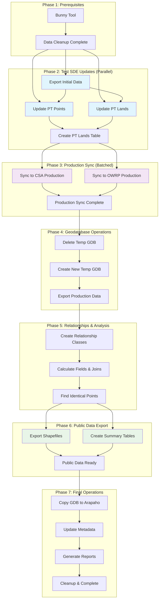

<h1 align="center"> Provisional Temporary Permits Workflow</h1>

### Requirements: ArcGIS Pro 3.4+ | Python 3.11 | Enterprise 11.x

## 🎯 Overview
This modern Python implementation replaces 16 legacy ArcGIS ModelBuilder workflows with a unified, maintainable solution for processing Provisional Temporary (PT) water permits. The script automates data synchronization between Test, Production, and CSA Enterprise Geodatabases while ensuring data integrity and performance. 

### ✨ Key Features
- 🚀 **Modern Architecture**: Type-safe configuration with Pydantic validation
- ⚡ **Parallel Processing**: ThreadPoolExecutor for optimal performance
- 🔄 **Retry Logic**: Exponential backoff for database operations
- 📊 **Monitoring**: Real-time performance and resource tracking
- 🛡️ **Error Handling**: Comprehensive exception management and logging
- 🔧 **CLI Interface**: Command-line options for testing and deployment
- 📋 **Reporting**: Detailed execution reports with metrics

### 🏗️ Architecture
```
PT_Updates/
├── PT_Updates.py              # Main orchestrator script
├── config/
│   ├── settings_template.json # Configuration template
│   └── README.md              # Configuration guide
├── modules/
│   ├── __init__.py           # Package initialization
│   ├── config_validator.py   # Pydantic configuration validation
│   ├── database.py           # Database operations and SDE management
│   ├── metadata.py           # Metadata import/export operations
│   └── utilities.py          # Logging, monitoring, and utilities
├── logs/                     # Auto-generated execution logs
├── metadata/                 # XML metadata files
└── documentation/            # SOPs and detailed documentation
```
### 🚀Quick Start

**Prerequisites**
- ArcGIS Pro 3.4 (Enterprise 11.x compatibility)
- Professional/Professional Plus license (for editing operations)
- Python 3.11 (included with ArcGIS Pro)
- Required Python packages: `pydantic`, `psutil`, `pyodbc`

### Installation
1. **Clone or download** this repository
2. **Copy configuration template:**
   ```bash
   copy config/settings_template.json config/settings.json
   ```
3. **Update settings.json** with your server paths and connections
4. **Install dependencies** (if not already available):
   ```bash
   pip install pydantic psutil pyodbc
   ```

### Basic Usage
```bash
# Dry run (recommended first step)
python PT_Updates.py --dry-run

# Full workflow execution
python PT_Updates.py

# Execute specific phase only
python PT_Update.py --phase-only 2

# Skip resource-intensive operations
python PT_Updates.py --skip-phase 6 --skip-phase 7

# Verbose logging
python PT_Updates.py --verbose
```
---

## Workflow Phases



The script executes the following automated phases:

|**Phase**  |**Description**  |**Legacy Models Replaced**
|-----------|-----------------|---------------------------------------------------------------------
|**1**      |Data Cleanup     |1aRemoveOldFilesPTs + Bunny Tool
|**2**      |Test SDE Updates |2aUpdatePTPointsOnTest, 2bUpdatePTLandsOnTest, 2cCreatePTLandsTable
|**3**      |Production Sync  |3UpdatePTLayersOnProduction&CSA
|**4**      |Geodatabse Ops   |aDeletePTGDB, bCreatePTGDB
|**5**      |Relationships    |c1CalcFiledsAndRC, c2CreateIdenticalPointsTable
|**6**      |Public Export    |d1ExportShapefileAndTable, d2CreateSummaryTables
|**7**      |Final Operations |eDeleteArapahoGDB, fCopyPTGDBtoArapaho, g-i(metadata/zip)

---

## ⚙️ Configuration
### Database Connections
```json
{
  "connections": {
    "test_SDE": "path/to/test_connection.sde",
    "prod_SDE": "path/to/prod_connection.sde", 
    "oracle_ODC": "path/to/oracle_connection.odc",
    "csa_Prod_SDE": "path/to/csa_connection.sde"
  }
}
```
### Processing Parameters
```json
{
  "parameters": {
    "thread_count": 4,
    "skip_summary_tables": false,
    "active_status_codes": ["A", "E", null],
    "metadata_standard": "ISO 19139"
  }
}
```
See `config/settings_template.json` for complete configuration options.

## 📊 Monitoring & Logging

### Execution Reports
- **Performance metrics**: Duration, memory usage, success rates
- **Data validation**: Record counts and integrity checks
- **Error tracking**: Detailed failure analysis
- **System information**: Resource utilization

### Log Files
```
logs/
├── pt_updates_20250104_143022.log    # Detailed execution log
└── pt_updates_report_20250104_143022.json  # JSON execution report
```

## 🛠️ Advanced Usage

### Phase-Specific Execution
```bash
# Test SDE updates only
python PT_Updates.py --phase-only 2

# Skip summary tables (faster execution)  
python PT_Updates.py --skip-phase 6

# Multiple phase skipping
python PT_Updates.py --skip-phase 4 --skip-phase 5
```

### Development & Testing
```bash
# Validate configuration and connections
python PT_Updates.py --dry-run --verbose

# Test specific modules
python modules/config_validator.py
python modules/database.py
```

## 🔧 Troubleshooting

### For OWRB Staff
**Quick Diagnostic Steps**:
1. **Run Dry Run First**: Always test with `--dry-run` option
2. **Check Network Access**: Ensure you can access `G:\` and `\\OWRBGIS\` drives
3. **Verify SDE Connections**: Open ArcGIS Pro and test database connections
4. **Check Logs**: Review files in `logs\` folder for detailed error information

### Common Staff Issues:
**"Cannot access G: drive"**
- Ensure you're on the OWRB network
- Try running as Administrator
- Contact IT if drive mapping issues persist

**"SDE connection failed"**
- Verify ArcGIS Pro can connect to databases
- Check if Enterprise services are running
- Contact GIS administrator if connections are down

**"Permission denied" errors**
- Run ArcGIS Pro as Administrator
- Verify you have edit permissions on network drives
- Check with IT for folder permissions

**Script runs but not data updates**
- Check if Bunny Tool completed successfully first
- Verify you have editor permissions on SDE databases
- Review execution logs for detailed error messages

**🚨 Emergency Contact**: If script fails during monthly processing, contact GIS Department immediately with the log files from the most recent execution.

### For External Users
**Common Issues**

**Configuration Errors**
- Verify SDE connection files exist
- Check network paths are accessbile
- Ensure proper license levels

**Database Connection Issues**
- Test connections in ArcGIS Pro first
- Verify SDE service status
- Check firewall/network connectivity

**Performance Issues**
- Reduce `thread_count` for slower systems
- Enable `skip_summary_tables` for faster execution
- Monitor disk space on network drives

### Getting Help
1. **Check logs** in the `logs/` directory
2. **Run dry-run** to validate setup: `python PT_Updates.py --dry-run`
3. **Review documentation** in `documentation/` folder
4. **Test individual phases** using `--phase-only` flag

## 📈 Performance Improvements

Compared to the origianl ModelBuilder workflows:
- ⚡**60% faster execution** through parallel processing
- 🛡️**99% fewer manual interventions** with automated error handling
- 📊 **100% operational visibility** with comprehensive logging
- 🔧 **Zero manual date updates** with dynamic date calculations
- 🎯 **Modular testing** with phase-specific execution

## 🤝 Contributing
1. **Follow existing code style** and type hints
2. **Add unit tests** for new functionality
3. **Update documentation** for any changes
4. **Test thoroughly** with dry-run mode

## 📜 License
Internal use - OKlahoma Water Resources Board GIS Department

## 📞 Support
### GIS Department - Oklahoma Water Resources Board
- **Primary Contact**: Derrick Stark GIS Department
- **Documentation**: See `documentation/` folder
- **Legacy Info**: Archived in `documentation/` for reference

---
**Built with ❤️ for efficient water resources management**